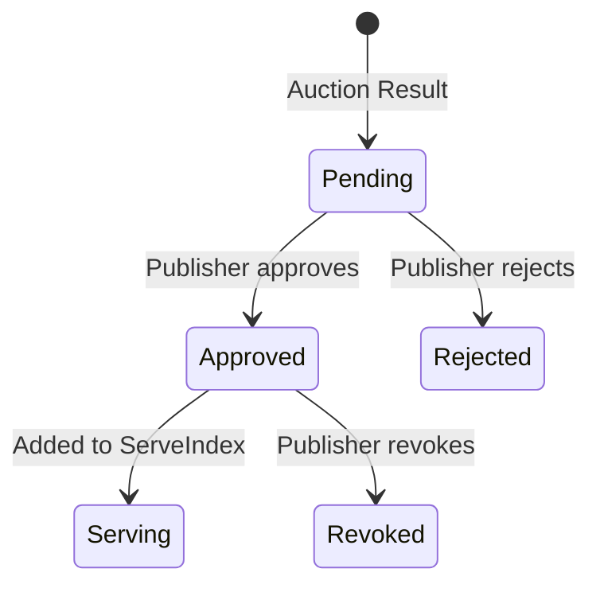

# パブリッシャーによるクリエイティブ承認

従来のアドテクでは、パブリッシャーは自分のサイトに何が表示されるかについて発言権がありません。エクスチェンジが落札者を選び、パブリッシャーのAdServerがそれを表示します――中身を確認することなく。不適切な広告が紛れ込んだ場合、パブリッシャーにできることは事後にクレームを出すことだけです。

Promovolveはこれを逆転させます。**すべてのクリエイティブは、読者に表示される前にパブリッシャーの承認を得なければなりません。** これは後付けのコンプライアンス機能ではなく、オークションシステム、マルチ候補アーキテクチャ、配信パイプラインの設計を規定するコアな制約です。

## なぜ承認が重要なのか

雑誌広告には常にパブリッシャーの承認がありました。料理雑誌の編集者は掲載前にすべての広告を審査していました――レシピの隣にギャンブル広告はなし、特集記事の隣に競合他社の広告もなし。パブリッシャーの編集判断は製品の一部だったのです。

Promovolveはこれをウェブに復活させます。日本の旅行ブログを運営するパブリッシャーは以下のことができます：
- 京都の寺院記事を補完する旅館の広告を承認する
- 編集方針に合わないファストフードチェーンの広告を拒否する
- 特定の広告プロダクトカテゴリ（ギャンブル、アルコールなど）をサイト全体でブロックする
- 基準が変わった場合に、以前承認したクリエイティブを取り消す

これこそがPromovolveがマルチ候補オークションを採用する理由でもあります。もしシステムが落札者を1つだけ選び、パブリッシャーがそれを拒否した場合、スロットは空になってしまいます。複数の候補がキューに入っていれば、1つを拒否しても次の候補が繰り上がるだけです。

## 承認のライフサイクル

クリエイティブはシステム内を進む際に、以下の明確なステートを遷移します：



### 1. オークションが候補を生成する

AuctioneerEntityは広告スロットごとに複数の候補をショートリストし、AdServerに送信します。各候補には`preApproved`フラグが付いていますが、AdServerはそれを盲目的に信頼しません。

### 2. AdServerが実際の承認ステータスを判定する

AdServerは`preApproved`フラグ（確率的なCuckoo filterから得られるもので、偽陽性の可能性がある）に依存する代わりに、ServeIndexを照会して、どのクリエイティブが*実際に*配信中かを確認します：

```
existingCreativeIds =
    creatives in this slot's ServeIndex
  + creatives approved at any other slot on this site (inverted index)
  + creatives loaded from DB on startup (persisted approvals)
```

この3つのソースのマージにより：
- あるスロットで承認されたクリエイティブはサイト全体で認識される
- 承認はプロセスの再起動を経ても維持される（PostgreSQLから読み込まれる）
- 再オークション時に既に承認済みのクリエイティブが再キューされない

### 3. パーティション：承認済み vs 保留中

AdServerは候補を2つのグループに分割します：

```
approved = candidates whose creativeId is in existingCreativeIds
pending  = everything else
```

**承認済みクリエイティブ**はそのままServeIndexに登録されます――既に信頼されているからです。AdServerはTaxonomyRankerEntityからカテゴリスコアを取得し、CDNアセットURLとサイズ情報を含む`CandidateView`オブジェクトを構築し、DDataに書き込みます。これらはすぐに配信可能です。

**保留中のクリエイティブ**は`PendingSelectionStore`（PostgreSQL）にキューされ、パブリッシャーのレビューを待ちます。承認されるまで配信されません。

### 4. ブロックリストフィルタリング

上記のすべてが行われる前に、候補は2つのブロックリストでフィルタリングされます：

- **ドメインブロックリスト**：パブリッシャーは特定のランディングドメインをブロックできます。競合サイトにリンクするクリエイティブは、保留キューに届く前にフィルタリングされます。
- **広告プロダクトカテゴリブロックリスト**：パブリッシャーはプロダクトカテゴリ全体（ギャンブル、アルコール、銃器など）をブロックできます。DDataを通じて配布され、このフィルタはオークション時に実行されます。

ブロックされたクリエイティブはサイレントに除外されます――パブリッシャーの承認キューに表示されることはありません。

## 保留キュー

保留キューは、新しいクリエイティブに対するパブリッシャーの受信箱です。PostgreSQL（テーブル：`pending_selection`）に永続化されているため、再起動しても保持されます。

### データモデル

各保留エントリは`Selection`です――特定の（パブリッシャー、URL、スロット）の組み合わせに対する候補の順序付きリストです：

```
Selection
  publisherId: String
  url:         String
  slotId:      String
  ordered:     Vector[Candidate]   — ranked by CPM
  idx:         Int                 — index of current candidate being reviewed
  state:       Pending
  expiresAt:   Instant             — TTL-based expiration
```

`idx`ポインタは、パブリッシャーが現在レビューしている候補を追跡します。クリエイティブが拒否されると、ポインタは次の候補に進みます。

### 主な操作

| Operation | What happens |
|-----------|-------------|
| `upsertPending` | Write/overwrite a pending selection for a slot |
| `getPending` | Fetch current pending for a slot |
| `pendingQueue` | List all pending items for a publisher (for the dashboard) |
| `removeCreativeFromPending` | Remove a specific creative after approval, keep the rest |
| `rejectAndPromote` | Reject current candidate, advance to next in queue |
| `purgeExpired` | Clean up expired selections (TTL-based) |
| `flagCreative` | Quarantine a creative with a reason (for later review) |
| `unflagCreative` | Return a quarantined creative to the pending queue |

### 予算消化時のクリーンアップ

キャンペーンや広告主の予算が尽きた場合、そのクリエイティブは保留キューから削除されます――支払いができない広告をパブリッシャーにレビューしてもらう意味はありません：

| Event | Cleanup |
|-------|---------|
| Campaign budget exhausted | `removeByCampaignId` — remove all pending creatives for this campaign |
| Advertiser budget exhausted | `removeByAdvertiserId` — remove all pending creatives for this advertiser |
| Creative paused | `removeCreativeFromAll` — remove from all pending slots |
| Landing domain blocked | `removeByLandingDomain` — remove all creatives with this domain |
| Ad product category blocked | `removeByAdProductCategory` — remove all creatives in this category |

## パブリッシャーの3つのアクション

### 承認

パブリッシャーが保留中のクリエイティブをレビューし、承認します：

1. クリエイティブIDがキュー内の現在の候補と一致することを検証する
2. TaxonomyRankerEntityからカテゴリスコアを取得する
3. CDNアセットURL、サイズ、メタデータを含む`CandidateView`を構築する
4. DData経由でServeIndexに追加する――クリエイティブがライブになる
5. PostgreSQLに承認を永続化する（`insertApproved`）――再起動しても保持される
6. AdvertiserEntityを`ApprovalStatus.Approved`で更新する
7. 保留キューから削除する
8. SSEイベントをブロードキャストする：`approved`

クリエイティブは次のページロードから読者への配信を開始します。

### 拒否

パブリッシャーが保留中のクリエイティブをレビューし、拒否します：

1. AdvertiserEntityを`ApprovalStatus.Rejected`で更新する――Bloom filterに記録され、このサイトの将来のオークションで同じクリエイティブが再提出されなくなる
2. ServeIndexから削除する（もし何らかの理由で登録されていた場合）
3. `rejectAndPromote`を呼び出してキューを次の候補に進める
4. キューが枯渇した場合（候補が残っていない場合）、他のキャンペーンがスロットを埋められるよう再オークションをトリガーする
5. SSEイベントをブロードキャストする：`rejected`

拒否はこのサイトでは永続的です――Bloom filterにより、同じクリエイティブが将来の保留キューに再び表示されることはありません。

### 取り消し

パブリッシャーが以前承認したクリエイティブについて考えを変えた場合：

1. ServeIndexから削除する――クリエイティブは即座に配信停止となる
2. AdvertiserEntityの承認済みフィルタと拒否済みフィルタの両方からクリアする
3. SSEイベントをブロードキャストする：`revoked`

拒否とは異なり、取り消しは可逆的です――クリエイティブは後で再び承認キューに入れることができます（例：広告主がクリエイティブを更新した後）。

### 一括承認

広告主を信頼している、またはキューを素早く処理したいパブリッシャー向け：

```
POST /v1/publishers/{publisherId}/sites/{siteId}/creatives/bulk-approve
```

スロットのすべての保留中クリエイティブを一括で承認します。各クリエイティブは同じ承認フロー（ServeIndex更新、DB永続化、AdvertiserEntity通知）を経ます。単一のSSEイベント（`bulk-approved`）が件数とともにブロードキャストされます。

## リアルタイム通知（SSE）

パブリッシャーは新しいクリエイティブをポーリングする必要はありません。PromovolveはServer-Sent Eventsを通じてリアルタイムでイベントをストリーミングします：

```
GET /v1/publishers/{publisherId}/sites/{siteId}/events
```

### イベントタイプ

| Event | When | Payload |
|-------|------|---------|
| `pending-updated` | New creatives queued for review | siteId, url, slotId, count, topCreativeId |
| `approved` | Creative approved and now serving | siteId, url, slotId, creativeId |
| `rejected` | Creative rejected | siteId, url, slotId, creativeId |
| `bulk-approved` | Multiple creatives approved at once | siteId, url, slotId, approvedCount |
| `revoked` | Approval revoked, creative removed from serving | siteId, creativeId |
| `creative-status-changed` | Creative paused or reactivated by advertiser | creativeId, campaignId, status |
| `campaign-status-changed` | Campaign status changed | campaignId, status |
| heartbeat | Keep-alive ping | (empty, every 30 seconds) |

### アーキテクチャ

`PendingEventHub`アクターはサイトごとにグループ化されたSSEサブスクライバーを管理します：

```
PendingEventHub
  └── subscribers: Map[siteId → Set[ActorRef[PendingEvent]]]
```

- サイト固有のイベント（pending、approved、rejected）はそのサイトのサブスクライバーに送信される
- サイト横断のイベント（creative-status-changed、campaign-status-changed）はすべてのサブスクライバーにブロードキャストされる
- SSEストリームが終了するとサブスクライバーは自動的に登録解除される
- 失効したサブスクライバーはアクターのdeath-watchによってクリーンアップされる

## Pre-Approved：オークションのタイブレーカー

AuctioneerEntityが候補をソートする際、Pre-Approvedのクリエイティブにはタイブレーカーの優位性が与えられます：

```
sort key = (-CPM, if preApproved then 0 else 1)
```

同じCPMの場合、Pre-Approvedのクリエイティブは未承認のものより上位にランクされます。これには2つの効果があります：

1. **配信までの時間短縮**：Pre-Approvedのクリエイティブは保留キューをスキップして直接ServeIndexに登録されるため、より早くインプレッションを獲得し始める
2. **再オークションの安定性**：再オークション実行時に、既に承認済みのクリエイティブはキューに滞留する新しい未承認のクリエイティブに押し出されることなく、そのポジションを維持する

## 承認がマルチ候補オークションを可能にする仕組み

承認ワークフローこそがPromovolveがマルチ候補オークションを採用する理由です。代替案を考えてみましょう：

**承認なしの単一落札者オークション**：エクスチェンジが1つの落札者を選びます。即座に配信開始。パブリッシャーは子供の教育ブログにオンラインギャンブルの広告が表示されているのを目にします。ダメージは既に発生しています。

**承認ありの単一落札者オークション**：エクスチェンジが1つの落札者を選びます。パブリッシャーがそれを拒否します。次のオークションまでスロットは空です。読者には広告が表示されません。収益はゼロです。

**承認ありのマルチ候補オークション**：オークションが3つの候補をショートリストします。パブリッシャーが最初の1つを拒否します。2番目の候補は既にキューに入っていて準備完了です。スロットが空になることはありません。収益は継続します。パブリッシャーは編集上のコントロールを維持します。

これこそが承認を大規模に実用的にする設計です――これがなければ、パブリッシャーの承認はクリエイティブが拒否されるたびに空スロットと収益損失を意味することになります。

## 承認の永続化

承認は異なる目的のために2つの場所に保存されます：

| Storage | Purpose | Survives restart? |
|---------|---------|-------------------|
| ServeIndex (DData) | Fast serve-time lookups | No (ephemeral, rebuilt from auctions) |
| PostgreSQL (`approved_creatives`) | Approval state of record | Yes |
| `keysByCreative` (in-memory inverted index) | Site-wide approval recognition | No (rebuilt from ServeIndex on startup) |
| `persistedApprovedIds` (loaded from DB) | Bootstrap approvals on startup | Yes (loaded from PostgreSQL) |

起動時、AdServerはPostgreSQLから`persistedApprovedIds`を読み込みます。再オークションが実行されると、このセット内のクリエイティブは既に承認済みとして認識され、保留キューをスキップします――パブリッシャーは既にレビューしたクリエイティブを再承認する必要はありません。
