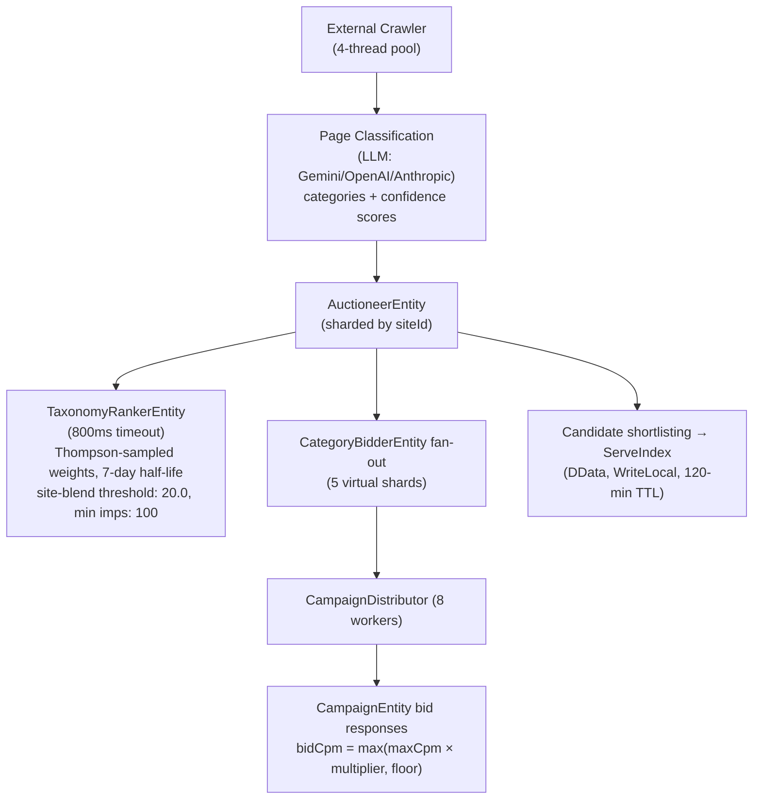
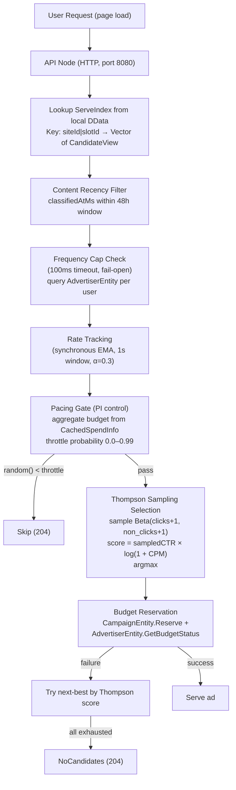

# データフロー: CrawlとServe

Promovolveはワークロードを、根本的に異なるパフォーマンス特性を持つ2つのフェーズに分離しています。

## Crawlフェーズ（書き込みパス）

Crawlフェーズは設定可能なスケジュール（デフォルト: Quartz cron `"0 0 2 * * ?"` — 毎日午前2時）で実行され、「重い」計算パスです。サイトごとのクロール設定には`maxDepth`（デフォルト: 2）と`concurrency`（デフォルト: 5）が含まれ、4つの固定スレッドを持つ専用の`crawler-dispatcher`上で実行されます。

## Serveフェーズ（読み取りパス）

Serveフェーズはすべての広告リクエストを処理するため、極めて高速でなければなりません。

## なぜ2つのフェーズに分けるのか?

| 関心事 | Crawlフェーズ | Serveフェーズ |
|---------|-------------|-------------|
| レイテンシ | 数秒かかっても問題ない | 1ms未満が必須 |
| 計算量 | フルオークション、LLM分類 | キャッシュルックアップ + Beta sampling |
| Fan-out | 多数のentity | ゼロ（ローカルDData） |
| 障害時の動作 | 次回クロールでリトライ | キャッシュされた候補を配信 |
| スケーリング | entityノードの追加 | APIノードの追加 |
| Dispatcher | `crawler-dispatcher` (4 threads) | デフォルトのPekko dispatcher |

この分離により:
1. **オークションの複雑さが配信レイテンシに影響しない** — LLM分類とマルチentityのfan-outはバックグラウンドで実行される
2. **配信キャパシティが独立してスケールする** — APIノードの追加によりオークション負荷に影響を与えずにリクエストスループットを向上できる
3. **一時的な障害がユーザーに見えない** — キャッシュされた候補は120分のTTLが切れるまでServeIndexに残り続ける
