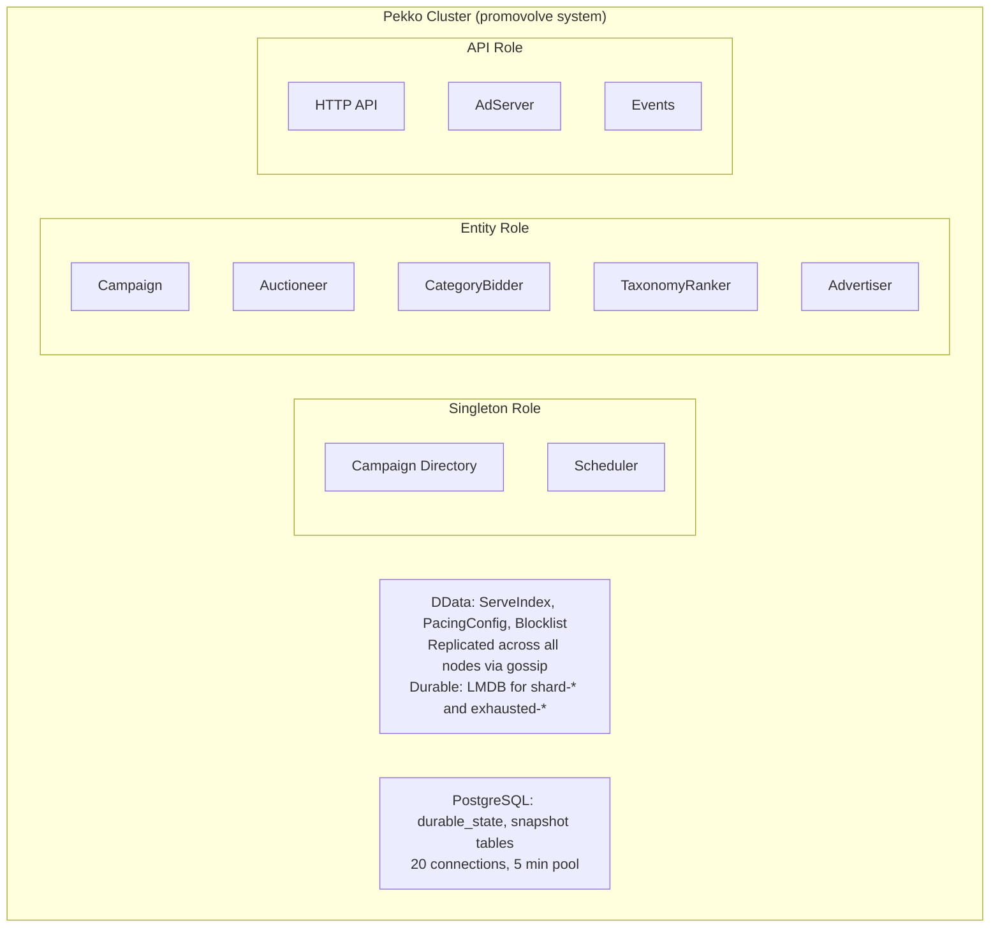

# システムアーキテクチャ

Promovolveは、3つの異なるノードロールを持つApache Pekko Clusterとして動作し、entityの分散にはCluster Shardingを、レプリケーションされたインメモリ状態にはDistributed Data (DData)を使用します。永続化にはJDBC (Slick)経由でPostgreSQLを使用します。

## 上位レベルのコンポーネント

## Cluster設定

`application.conf`より:

| Setting | Value |
|---------|-------|
| Cluster roles | `singleton`, `entity`, `api` (env: `PEKKO_CLUSTER_ROLES`) |
| Number of shards | 100 |
| Remember entities | on (via DData store) |
| Passivation timeout | 5 minutes |
| Split-brain strategy | `keep-majority` (stable after 20s) |
| Heartbeat interval | 1s, threshold 12.0, acceptable pause 10s |
| Remote frame size | 256 KiB |
| Seed node | `pekko://promovolve@127.0.0.1:25520` |

## DData設定

| Setting | Value |
|---------|-------|
| Gossip interval | 2s |
| Notify subscribers interval | 500ms |
| Max delta elements | 500 |
| Durable keys | `shard-*`, `exhausted-campaigns` |
| Durable store | LMDB (100 MiB map, 200ms write-behind) |
| Pruning interval | 120s (dissemination: 300s) |

## 主要な設計上の判断

1. **100 shards** とremember-entities-via-DDataにより、entityはノードの再起動後も生存し、自動的にリバランスされます（rebalance-absolute-limit: 20、relative: 0.1）。

2. **ServeIndexにDDataを採用**することで、すべてのAPIノードがアクティブな広告候補のローカルレプリカを保持します。配信時のルックアップがネットワークを越えることはありません。

3. **LMDBによる永続化**はshardメタデータとexhausted-campaigns状態に適用されますが、ServeIndex自体はエフェメラルであり、再起動時にオークションから再構築されます。

4. **ロールの分離**により、読み取り（API）と書き込み（entity）のワークロードを独立してスケーリングできます。singletonロールはCampaignDirectoryのようなクラスタ全体のコーディネーターをホストします。
