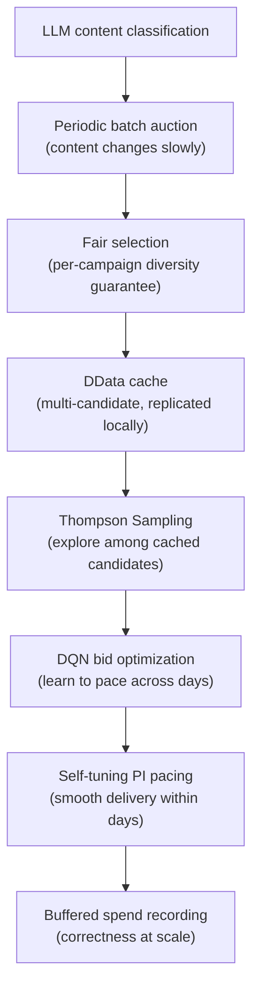

# 主要なイノベーション

Promovolveの設計上の選択は、各イノベーションが次のイノベーションを可能にする一貫したシステムを形成しています。

## 1. ユーザーベースではなくコンテンツベース

**従来**：ユーザープロフィール、cookie、デバイスフィンガープリンティングが広告ターゲティングを支えている。

**Promovolve**：ターゲティングは**LLMベースのコンテンツ分類**（Gemini/OpenAI/Anthropic）を使用して広告をページのトピックにマッチさせる。ユーザートラッキングなし、cookieなし。

**その重要性**：プライバシー保護（GDPR/CCPAのデータ収集なし）、シンプルなインフラ（プロフィールデータベースなし）、コンテンツ価値の整合（広告がユーザーが現在読んでいるものに一致）。

## 2. 新しいコンテンツのみのマネタイズ

**従来**：公開日に関係なく、どのページにも広告を表示。

**Promovolve**：**48時間の新しさウィンドウ**内のコンテンツのみが参加。AuctioneerEntityが5分ごとに古い分類を削除。

**その重要性**：新しいコンテンツはエンゲージメントが高い → CTRが高い → すべての参加者にとってより良い結果。低品質な在庫を削減。

## 3. 定期的なバッチオークション

**従来**：ページ読み込みごとに1回のオークション。

**Promovolve**：クロールごとに1回のオークション（Quartz cronでスケジュール）+ 5分ごとの再オークション。

**その重要性**：オークションコストをトラフィックから分離。DDataローカルレプリカによるサブミリ秒配信。複数候補のキャッシングを可能に。

## 4. 公平な選択 + 複数候補MAB

**従来**：オークションごとに単一の勝者。

**Promovolve**：オークション時のキャンペーンごとの多様性保証（まず各キャンペーンに1クリエイティブ）、その後配信時にThompson Samplingがキャッシュされた候補の中から探索。

**その重要性**：どのクリエイティブが実際にユーザーを引きつけるかを発見。予算枯渇時の優雅なデグレード。自己修正（パフォーマンスの低いクリエイティブは自然にシェアを失う）。

## 5. 純粋Scala Double DQN

**従来**：DSPはbid-shadingアルゴリズムを使用（多くの場合Python/C++のMLフレームワーク）。

**Promovolve**：各キャンペーンが専用のDouble DQNエージェント（8→64→64→5、約4,800パラメータ）を持ち、純粋なScalaで実装。TensorFlowなし、PyTorchなし。

**その重要性**：Pekkoアクター内に存在し、プロセス間通信なし。重みはCampaignEntityのステートに`Array[Double]`としてシリアライズ。JVMのみのデプロイメント。

## 6. 自己チューニングPIペーシング

**従来**：シンプルなルール（「正午までにX%を消費」）または固定ゲインコントローラー。

**Promovolve**：PIコントローラーで以下を備える：
- **適応ゲイン**：トラフィックの変動性（CV）に応じてスケーリング
- **自己チューニングoverpace multiplier**（1.5x-5.0x、20サンプルごとに調整）
- **振動検出**（標準偏差閾値0.08 → 減衰）
- **リーキー積分器**（減衰0.995、anti-windup）
- **日をまたぐ学習**（予算が早期に枯渇した場合、multiplierを引き上げ）
- **トラフィックシェイプ認識**（平日/週末別の24時間プロフィール）

**その重要性**：手動チューニングなしにあらゆるトラフィックパターンに適応。過去の日の失敗から学習。

## 7. バッファリングされたAt-Least-Once支出記録

**従来**：インプレッションごとのデータベース書き込み。

**Promovolve**：支出イベントをバッファリング（500msタイマーまたは20件のバッチ）、Bloomフィルターで重複排除（5万エントリ、0.01% FPP）、指数バックオフリトライによるat-least-once配信。

**その重要性**：正確性の保証を維持しながら永続化の負荷を約20分の1に削減。

## 統合された全体像

各選択が次を可能にします。1つを取り除けば、システムの一貫性が失われます。組み合わさることで、高速で、学習し、プライバシーを保護し、パブリッシャーに寄り添う広告プラットフォームが生まれます。
