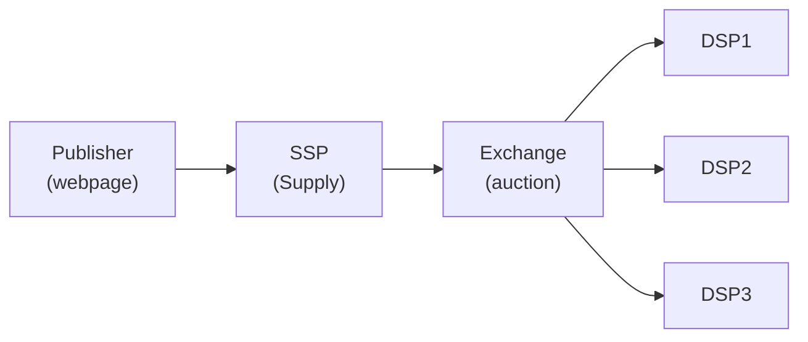
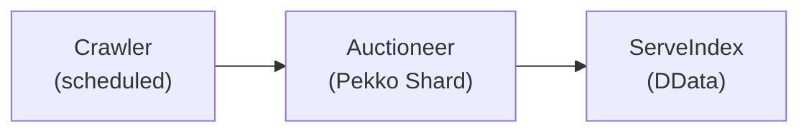
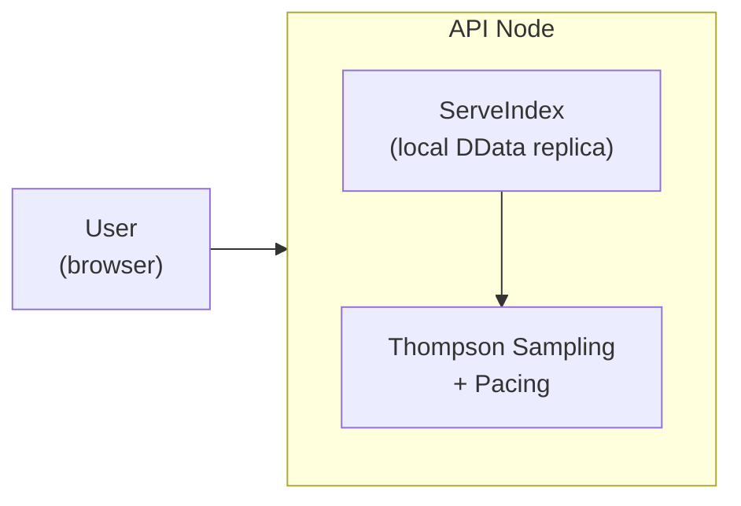

# Promovolve vs SSP/DSP/Exchange

この章では、Promovolveの設計上の選択を、従来のプログラマティック広告スタックと対比します。

## 従来のプログラマティックスタック

**フロー**：ユーザーがページを読み込む → SSPが入札リクエストを送信 → Exchangeが各DSPにブロードキャスト → DSPが100ms以内に応答 → 最高入札者が落札 → 広告が配信される。

## Promovolveのスタック

Promovolveは、SSP、DSP、exchangeを単一のシステムに統合し、2つの異なるフェーズに分けます：事前に実行される**オフラインオークションフェーズ**と、ユーザーリクエストに応答する**オンライン配信フェーズ**です。

### フェーズ1：オフラインオークション（ユーザー不在）

1. **Crawler**が定期的にパブリッシャーのページを取得し、LLM（Gemini Flash）に送信してIABタクソノミーカテゴリへのコンテンツ分類を行います。
2. **AuctioneerEntity** — サイトごとに1つ、Pekkoクラスタ全体にシャーディング — がバッチオークションを実行します。ページコンテンツに一致するターゲットカテゴリを持つすべてのキャンペーンから入札を収集し、RL調整された入札乗数とペーシングスロットルを適用し、広告枠ごとに複数の候補をショートリストに入れます（単一の勝者だけではなく）。
3. **ServeIndex** — Pekko Distributed Data (DData)上に構築されたレプリケートされたインメモリキャッシュ — がショートリストされた候補を格納します。クラスタ内のすべてのノードがローカルレプリカを保持するため、配信時にリモートコールは不要です。

このフェーズはスケジュール（デフォルトで5分ごと）およびコンテンツ変更時に再実行され、ユーザーの到着を待たずに候補を最新に保ちます。

### フェーズ2：オンライン配信（ユーザー到着）

ServeIndexは独立したサービスではありません — DDataでレプリケートされたデータ構造であり、すべてのAPIノードが自身のプロセスメモリにローカルレプリカを保持しています。APIノードとServeIndex間にネットワークコールはありません。ローカルのインメモリルックアップです。

1. **ユーザー**が閲覧中のページの広告をリクエストします。
2. **APIノード**がローカルのServeIndexレプリカから事前に計算された候補を直接読み取ります — ネットワークホップなし、オークションなし、外部コールなし。
3. **Thompson Sampling**がショートリストされた候補の中から選択し、新しいクリエイティブの探索と既知の高パフォーマーの活用のバランスを取ります。ペーシングチェックにより、選択されたキャンペーンがこの時間枠の予算を使い果たしていないことを確認します。

結果：1ms未満の配信レイテンシで、ユーザーデータの収集なし、cookieの設定なし、サードパーティコールなし。

### 何が何に置き換わったか

| 従来の役割 | Promovolveでの対応 |
|---|---|
| SSP（supply-side platform） | Crawler + AuctioneerEntity — パブリッシャーの在庫は入札リクエストの発行ではなく、クローリングによって発見される |
| Exchange（オークションハウス） | AuctioneerEntity — ユーザートラフィックに先行して、オフラインでオークションを実行 |
| DSP（demand-side platform） | Campaign entities + DQN RLエージェント — 広告主の入札戦略は別のシステムで設定されるのではなく、自動的に学習される |
| Ad server | APIノード + ローカルDDataレプリカ — メモリから事前計算された結果を配信 |
| DMP（data management platform） | 不要 — ターゲティングはユーザーベースではなくコンテンツベース |

## 比較サマリー

| 側面 | 従来のSSP/DSP | Promovolve |
|--------|-------------------|------------|
| オークションタイミング | リクエストごと（リアルタイム） | クロールごと + 5分再オークション |
| 配信レイテンシ | 50-200ms | < 1ms |
| 勝者選択 | 最高入札者が勝利 | 公平な選択 → Thompson Sampling |
| 価格モデル | Second-price (GSP) | First-price、RL調整CPM |
| 価格発見 | あり（競争的） | なし（RLがペーシングを最適化） |
| 学習 | RTBフィードバックループ | TS + DQN RL + カテゴリランキング |
| 候補モデル | 単一の勝者 | 多様性を持つ複数候補 |
| 予算管理 | キャンペーンごとのスロットリング | 集約PI制御ペーシング |
| ステート永続化 | Database/Redis | DData（レプリケートされたインメモリ） |
| コンテンツスコープ | 任意のページ、任意の時間 | 新しいもののみ（48時間以内） |
| ターゲティング | ユーザープロフィール、cookie | コンテンツ分類（LLM） |
| 障害モード | 広告が表示されない | キャッシュされた候補を配信 |
| プライバシー | ユーザートラッキングが必要 | ユーザープロフィールなし |

以下のサブチャプターでは、各違いを詳しく検討します。
