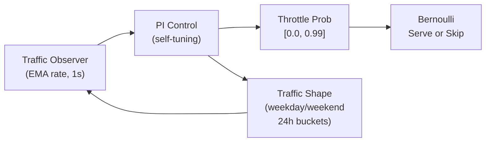

# ペーシング概要

予算ペーシングは、キャンペーンが1日の予算を一日を通じて均等に消化することを保証します。Promovolveは、トラフィックシェイプ認識、leaky integrator anti-windup、振動検出、日跨ぎ学習を備えた**自己チューニングPI control loop**を使用しています。

## なぜペーシングが重要なのか

ペーシングがなければ、1日の予算が$100でCPMが$5のキャンペーンは20,000インプレッション後に予算を使い果たします。それらが朝のピーク時に到着した場合、キャンペーンは残りの時間帯で配信停止になります。

## なぜPI controlがここで有効なのか

PI (Proportional-Integral) controlは、産業プロセス制御に由来する技術です — サーモスタット、モーター速度制御、化学プラントの流量制御など。コントローラがシステムの出力を観測し、単一の入力を調整して目標値に近づけることができる場合にうまく機能します。

Promovolveにおける予算ペーシングがこのモデルに適合するのは、**閉じたシステム**だからです。プラットフォームが方程式の両側を制御しています：

- **入力**：throttle probability（広告リクエストのうち配信する割合）
- **出力**：消化レート（予算がどれだけ早く消費されるか）
- **目標**：一日を通じた均等な配信（消化レート = 予算 / 残り時間）

コントローラは消化レートを観測し、目標と比較してスロットルを調整します。消化過多？スロットルを上げます（より多くのリクエストをスキップ）。消化不足？スロットルを下げます（より多く配信）。フィードバックループはタイトで、応答は予測可能です。

これは従来のプログラマティック広告スタックでは機能しません。RTBでは、パブリッシャーがインプレッションをエクスチェンジに送信し、キャンペーンが特定のオークションで落札できるかどうかを制御できません — それは未知のDSPからの競合入札に依存します。キャンペーンの配信レートは、ペーシングコントローラが観測も影響もできない市場のダイナミクスの関数です。入札額を調整することはできますが、結果を制御することはできません。

Promovolveでは、配信時に競合する外部オークションはありません。候補はすでにキャッシュされています。ペーシングゲートは各リクエストに対する単純なyes/noの判定であり、コントローラはその判定に対して完全な権限を持っています。これにより、制御理論の意味でシステムが**可制御**になります — 入力（スロットル）が出力（配信レート）を直接決定し、観測不可能な外部擾乱がありません。

これが、従来のアドテク業界がヒューリスティックなルールと希望的観測で解決している問題に対して、よく理解された安定的で解析的に扱いやすい技術であるPI controllerが機能する理由です。

## Promovolveのアプローチ



## 主要コンポーネント

1. **[Rate Tracking (EMA)](./rate-tracking.md)**：同期的、1秒ウィンドウ、α=0.3
2. **[PI Control Loop](./pi-control.md)**：自己チューニングゲイン、非対称応答、leaky integrator
3. **[Traffic Shape Learning](./traffic-shape.md)**：平日/週末別の24時間プロファイル
4. **[Grace Periods](./grace-periods.md)**：MaxThrottleProb (0.99)によるスタートアップ保護

## パイプラインの位置

ペーシングはThompson Samplingの前の**ボリュームゲート**として機能します：

```
Content recency → Frequency cap → Rate tracking → Pacing gate → Thompson Sampling
```

ペーシングゲートはベルヌーイ判定を行います：`if random() < throttleProbability → skip (204)`。これはボリュームをゲートするものであり、選択をゲートするものではありません — Thompson Samplingはゲートを通過したリクエストに対してのみ実行されます。

## 主要な定数（AdaptivePacing.scalaより）

| Constant | Value |
|----------|-------|
| `MaxThrottleProb` | 0.99 (1.0はハードストップ用に予約) |
| `DefaultKp` | 0.5 |
| `DefaultKi` | 0.3 |
| `BaseOverpaceGainMultiplier` | 2.0 |
| `IntegralDecayFactor` | 0.995 (leaky integrator) |
| `SpendRatioSmoothingAlpha` | 0.3 |
| `DefaultAvgCpm` | $5.00 |
