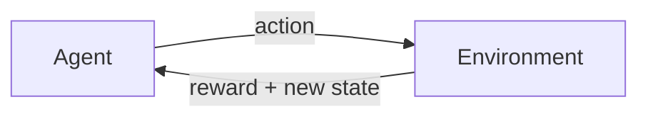
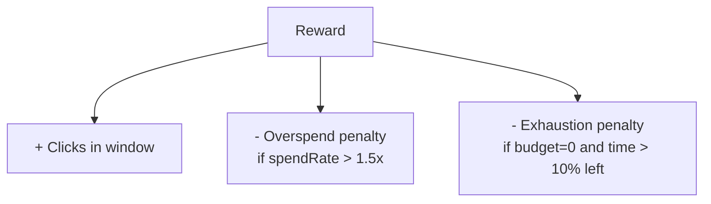
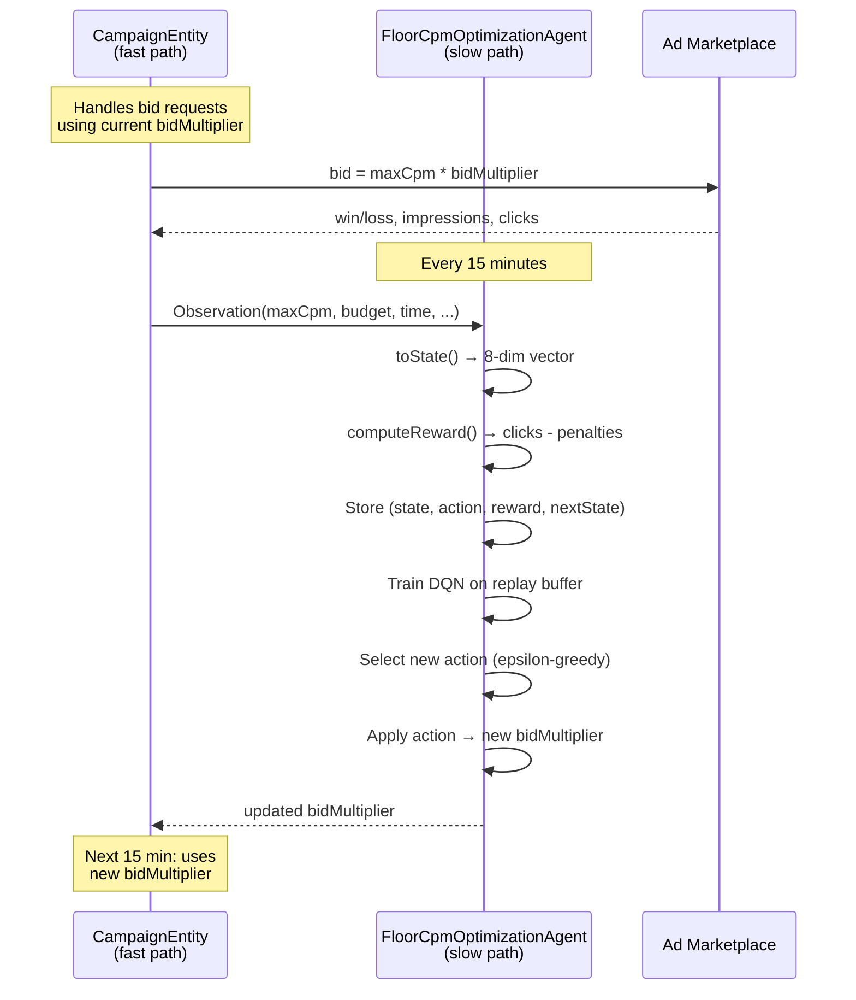

# RLの基礎: Agent、Environment、Reward

Reinforcement learningにはすっきりとした概念フレームワークがあります。4つの重要な要素を理解すれば、それ以外のこと --- Q-learning、neural network、探索戦略 --- はすべて*何を*ではなく*どのように*という詳細になります。

ループは以下の通りです:



1. **Agent**は世界の現在の**state**を観測する。
2. Agentは**action**を選択する。
3. Environmentは**reward**（数値: 高いほど良い）と**新しいstate**で応答する。
4. 繰り返す。

Agentの目標は、時間をかけて蓄積するrewardの合計を最大化するactionを選ぶことです。即時のrewardだけではなく、将来得られると期待されるものを含む*累積*rewardです。

これだけです。これがフレームワークのすべてです。それでは、各要素を広告入札の問題にマッピングしてみましょう。

## Agent: FloorCpmOptimizationAgent

Promovolveでは、各キャンペーンが独自の`FloorCpmOptimizationAgent`を持ちます。これがagentです。15分ごとに起動し、キャンペーンのパフォーマンスを確認し、bid multiplierを増やすか、減らすか、維持するかを決定します。

Agentは個々の広告リクエストを見ません。どのユーザーがクリックしたか、どのパブリッシャーが広告を配信したかも知りません。最後の15分間のウィンドウからの集約メトリクスのみを見ます: 合計インプレッション、合計クリック、合計支出、勝率。これは意図的なものです --- agentは粗い時間スケールで動作し、戦術的ではなく戦略的な意思決定を行います。

## Environment: 広告マーケットプレイス

Environmentは、agentの制御の*外側*にあるすべてのものです: 他の広告主の入札、パブリッシャーのトラフィック量、ユーザーの行動、時間帯。Agentはenvironmentを直接観測できません。受け取るメトリクスを通じて、environmentの*影響*のみを見ます。

これは重要な区別です。Agentは、競合が入札を30%引き上げたことを知りません。*知っている*のは、最後のウィンドウで勝率が0.6から0.3に下がったことです。その間接的なシグナルから正しい対応を見つけ出す必要があります。

## State: agentが観測するもの

15分ごとに、agentはキャンペーンの現在のメトリクスから8次元のstate vectorを構築します。各次元は数値で、通常0から2の範囲に正規化されています。以下は`FloorCpmOptimizationAgent.scala`の`toState()`メソッドです:

```scala
private def toState(obs: Observation): Array[Double] = {
  val maxCpm = if (obs.maxCpm > 0) obs.maxCpm else 1.0
  val dailyBudget = if (obs.dailyBudget > 0) obs.dailyBudget else 1.0

  Array(
    // 0: effective CPM (normalized)
    math.min(2.0, (obs.maxCpm * _bidMultiplier) / maxCpm),
    // 1: CTR in window
    if (windowImpressions > 0) math.min(1.0, windowClicks.toDouble / windowImpressions)
    else 0.0,
    // 2: win rate
    if (windowBidOpportunities > 0) windowWins.toDouble / windowBidOpportunities
    else 0.5,
    // 3: budget remaining fraction
    math.max(0.0, math.min(1.0, obs.budgetRemaining / dailyBudget)),
    // 4: time remaining fraction
    math.max(0.0, math.min(1.0, obs.timeRemaining)),
    // 5: spend rate vs ideal (1.0 = on pace)
    spendRate(obs),
    // 6: impression rate (normalized by expected)
    normalizedImpressionRate(obs),
    // 7: CPC (normalized)
    if (windowClicks > 0) math.min(2.0, (windowSpend / windowClicks) / maxCpm)
    else 0.0
  )
}
```

各次元とそれが重要な理由を見ていきましょう。

### 次元0: effectiveCpm

Agentの現在の入札レベルです --- `maxCpm * bidMultiplier`を`maxCpm`で正規化したもので、常に1.0付近になります。これはagentに「現在の入札はどこにあるか?」を伝えます。multiplierが1.0なら、この値は1.0です。multiplierが0.7なら、0.7です。

**なぜ重要か:** Agentは自身の現在の入札を知る必要があります。これがないと、以前の決定の記憶を持たないことになります。

### 次元1: ctr (click-through rate)

最後の15分間ウィンドウにおけるクリックとインプレッションの比率です。キャンペーンが200インプレッションを配信して4クリックを獲得した場合、CTRは0.02です。

**なぜ重要か:** CTRは広告品質の直接的なシグナルです。CTRが高い場合、現在の入札レベルは良質な在庫を獲得しています。CTRが下がった場合、agentは低品質なインプレッション（安いがクリックされない）を獲得しているか、オーディエンスの構成が変わった可能性があります。

### 次元2: winRate

入札機会のうち勝利した割合です。キャンペーンが500のオークションに入札して300勝した場合、勝率は0.6です。

**なぜ重要か:** 勝率はagentの競争力を示します。低い勝率（例えば0.1）は、agentがほとんどの場合で他より低い入札をしていることを意味し、multiplierを上げる必要があるかもしれません。非常に高い勝率（例えば0.95）は、agentが過剰入札している可能性を意味し、multiplierを下げて予算を節約しながらも十分なオークションに勝てるかもしれません。

### 次元3: budgetRemaining

まだ使われていない日次予算の割合です。1.0から始まり、0.0に向かって減少します。

**なぜ重要か:** これは希少性のシグナルです。午後2時で予算が既に0.2なら、agentは保守的になる必要があります。午後2時で予算が0.8なら、agentはより積極的になる余裕があります。

### 次元4: timeRemaining

配信期間の残り割合です。1日の始まりに1.0から始まり、終わりに0.0になります。

**なぜ重要か:** 時間コンテキストは重要です。予算が50%残っていることは、1日の50%が残っているか10%が残っているかによって、まったく異なる意味を持ちます。Agentはペーシングを推論するために両方の次元が必要です。

### 次元5: spendRate

実際の支出ペースと理想的な均等ペースの比率です。1.0はキャンペーンがちょうど予定通りに支出していることを意味します。2.0はあるべき速度の2倍で支出していることを意味します。0.5は支出不足を意味します。

これは、経過時間に対して*どれだけ使われるべきだったか*と実際にどれだけ使われたかを比較して計算されます:

```scala
private def spendRate(obs: Observation): Double = {
  if (obs.dailyBudget <= 0 || obs.timeRemaining >= 1.0) return 1.0
  val elapsed = 1.0 - obs.timeRemaining
  if (elapsed <= 0) return 1.0
  val expectedSpend = obs.dailyBudget * elapsed
  if (expectedSpend <= 0) return 1.0
  val actualSpend = obs.dailyBudget - obs.budgetRemaining
  math.min(3.0, actualSpend / expectedSpend) // cap at 3x overspend
}
```

**なぜ重要か:** これは最も重要なペーシングシグナルです。agentがペースを上げるべきか下げるべきかを直接伝えます。`budgetRemaining`と`timeRemaining`の次元は生の位置を示し、`spendRate`は速度を示します。

### 次元6: impressionRate

最後のウィンドウにおけるインプレッション数で、1ウィンドウあたり100インプレッションというベースライン期待値で正規化されています。

**なぜ重要か:** これはagentにトラフィック量を伝えます。impression rateが2.0なら、マーケットは忙しく、多くの在庫が利用可能です。0.1なら、トラフィックが薄いです。Agentはマーケット状況に応じて異なる入札を学ぶことができます: 例えば、低トラフィック期間（インプレッションが希少で高価）には予算を温存し、高トラフィック期間（安い在庫が豊富）には支出するなどです。

### 次元7: costPerClick

最後のウィンドウにおけるクリックあたりの平均コストで、`maxCpm`で正規化されています。

**なぜ重要か:** これは効率性の指標です。CPCが高い場合、agentは各クリックに多く支払っています --- より安い在庫を見つけるために入札を下げるべきかもしれません。CPCが低い場合、クリックが安く得られています --- 積極的になる良い機会です。

### なぜ正規化が重要か

すべての次元がキャップされ正規化されていることに注目してください。CTRは1.0にキャップされます。Effective CPMは2.0にキャップされます。Spend rateは3.0にキャップされます。これは、neural networkが入力が似たような数値範囲にあるときに最もよく機能するため重要です。ある次元が0から1の範囲で、別の次元が0から10,000の範囲だった場合、大きい次元がトレーニングを支配し、小さい次元は無視されてしまいます。

## Action: 7つの離散的な入札調整

Agentがstateを観測すると、7つのactionのうち1つを選ばなければなりません。各actionは、現在のbid multiplierに適用される乗算的な調整にマッピングされます:

| Action | 調整 | 意味 |
|:---:|:---:|:---|
| 0 | 0.7x | 入札を30%削減 --- 強い引き戻し |
| 1 | 0.8x | 入札を20%削減 --- 予算を温存 |
| 2 | 0.9x | 入札を10%削減 --- わずかな減少 |
| 3 | 1.0x | 現在の入札を維持 |
| 4 | 1.1x | 入札を10%増加 --- わずかな増加 |
| 5 | 1.2x | 入札を20%増加 --- 積極的に |
| 6 | 1.4x | 入札を40%増加 --- 強いプッシュ |

これらの調整は**累積的**です。multiplierが現在1.0でagentがaction 5（1.2x）を選ぶと、新しいmultiplierは1.2になります。次にagentがaction 4（1.1x）を選ぶと、multiplierは1.2 * 1.1 = 1.32になります。

multiplierは`[0.5, 2.0]`にクランプされます:

```scala
val adjustment = config.dqnConfig.multiplierForAction(action)
_bidMultiplier = math.max(
  config.minMultiplier,
  math.min(config.maxMultiplier, _bidMultiplier * adjustment)
)
```

action空間は**非対称**であることに注意してください --- 上方向には1.3xがありませんが、下方向には0.7xがあります。最も強い下方向のaction（0.7x）は、holdのactionに対して最も強い上方向のaction（1.4x）よりも急激な変化です。この設計は実践的な観察を反映しています: 通常、支出を*減らす*方が（予算枯渇は不可逆です）支出を*増やす*よりも緊急です（支出不足は後で修正できます）。0.7xの単一の「緊急ブレーキ」actionにより、必要なときに入札を急激に削減できます。

なぜ連続的な出力ではなく**離散的な**actionなのでしょうか? 2つの理由があります。第一に、離散的なaction空間はDQN（Promovolveが使用するアルゴリズム）で学習しやすいです。第二に、離散的なactionはagentの行動を解釈可能にします --- ログを見て「agentはaction 0（入札を30%削減）を選んだ」と読み取れます。「agentは0.7134を出力した」ではなく。

## Reward: 成功とは何か

Reward関数は、*agentに何を最適化させたいか*をエンコードする場所です。正しく設定すれば、agentは有用な行動を学びます。間違えると、agentはあなたが与えた数値を最大化する創造的な方法を見つけながら、意図しないことをします。

以下が`computeReward()`メソッドです:

```scala
private def computeReward(obs: Observation): Double = {
  // Primary reward: clicks achieved in this window
  val clickReward = windowClicks.toDouble

  // Penalty for overspending (spend rate > 1.5x means burning too fast)
  val rate = spendRate(obs)
  val overspendPenalty = if (rate > 1.5) config.overspendPenalty * (rate - 1.5) else 0.0

  // Penalty for budget exhaustion
  val exhaustionPenalty =
    if (obs.budgetRemaining <= 0 && obs.timeRemaining > 0.1)
      config.exhaustionPenalty
    else 0.0

  clickReward - overspendPenalty - exhaustionPenalty
}
```

Rewardには3つの要素があります:

### 主要reward: クリック

最後の15分間ウィンドウにおけるクリック数です。これが主要な目的です。クリックが多い = rewardが高い。

なぜインプレッションではなくクリックなのか? インプレッションは買うのが簡単だからです --- 高く入札すればすべてのオークションに勝てます。しかし、それは誰もクリックしないインプレッションに予算を費やします。クリックは広告主の価値のより良い代理指標です。

### ペナルティ: 過剰支出

支出レートが理想的なペースの1.5倍を超えると、agentは超過分に比例したペナルティを受けます。デフォルトのペナルティ係数は2.0なので:

- 支出レート1.5x: ペナルティなし
- 支出レート2.0x: ペナルティ 2.0 * (2.0 - 1.5) = 1.0
- 支出レート3.0x: ペナルティ 2.0 * (3.0 - 1.5) = 3.0

1.5xの閾値に注目してください。Agentは理想よりやや速く支出することが許容されます --- 今良い在庫があり、それを獲得する意味があるかもしれません。しかし、支出が理想レートの1.5倍を超えると、ペナルティが発動し、線形に増加します。これにより、agentにハードな制約ではなく「ソフトな予算」が与えられます: クリックに見合うなら少し過剰支出してもよいが、あまり多くはだめです。

### ペナルティ: 予算枯渇

配信期間の10%以上が残っている状態で予算がゼロになると、agentは5.0のフラットペナルティを受けます。これは「厳しい教訓」です --- 1日にまだ数時間残っている状態でお金が尽きたのです。5.0のペナルティは厳しく（それを取り返すには数ウィンドウ分の良いクリックが必要かもしれません）、agentにこの結果を避けることを教えます。

10%の閾値は、1日の最後の数分で予算を使い果たした場合にagentにペナルティを与えることを防ぎます。これはしばしば問題なく、むしろ望ましいことです --- 全予算を使い切り*たい*のです。

### まとめ

Reward関数は次のように言っています: 「できるだけ多くのクリックを獲得せよ、ただし予算を速く消費しすぎるな、そして絶対に多くの時間が残った状態で予算を使い果たすな」。Agentはこれらの競合する目的のバランスを取ることを学びます。



## Discount factor: 将来を評価する

Agentは現在の15分間ウィンドウのrewardだけを最大化するのではありません。すべての将来のrewardの**割引和**を最大化します:

```
total = r_0 + gamma * r_1 + gamma^2 * r_2 + gamma^3 * r_3 + ...
```

Promovolveは`gamma = 0.99`を使用します。これは、1ステップ先のrewardが現在のrewardの99%の価値があることを意味します。2ステップ先のrewardは0.99 * 0.99 = 98%の価値があります。20ステップ先: 0.99^20 = 82%です。

gamma = 0.99の場合、agentは将来の結果を強く考慮します。今積極的に入札すれば5クリック余分に得られるが、6ウィンドウ後に予算枯渇を引き起こす（例えば20クリック分の機会を失う）場合、agentはそのトレードを避けることを学びます。より低いgamma（例えば0.9）だとagentはより近視眼的になり、主に次の数ウィンドウを気にします。より高いgamma（例えば0.999）だと、agentは1時間後のrewardを現在のrewardとほぼ同じように扱います。

0.99はこの領域にとって良いデフォルト値です。1日にはおよそ96の15分間ウィンドウがあります。96ステップ後、`0.99^96 = 0.38`なので、agentは1日の始まりに意思決定するとき、1日の終わりに何が起こるかについてもまだ有意義に気にかけています。

## エピソード: 1日 = 1エピソード

RL用語では、**エピソード**は最初から最後までの完全なシーケンスです。Promovolveでは、1日が1エピソードに相当します。

1日の始まりに、agentは`bidMultiplier` 1.0で開始し、キャンペーンは全日次予算を持っています。1日の間、agentはおよそ96回の意思決定を行い（15分間ウィンドウごとに1回）、毎回観測に基づいてmultiplierを調整します。

1日の終わりに、`resetDay()`が呼び出されます:

```scala
def resetDay(): Unit = {
  // Store terminal transition
  for {
    ps <- prevState
    pa <- prevAction
  } {
    val terminalState = Array.fill(config.dqnConfig.stateSize)(0.0)
    val terminalReward = windowClicks.toDouble
    dqn.store(ps, pa, terminalReward, terminalState, done = true)
  }

  _bidMultiplier = 1.0
  prevObservation = None
  prevState = None
  prevAction = None
  // ... reset all window and day counters ...
}
```

ここでは2つのことが起こります:

1. **終端遷移。** Agentは`done = true`の最後の経験を保存します。これは学習アルゴリズムに「次のstate」がないことを伝えます --- エピソードは終了です。この時点以降の将来のrewardはゼロです。このシグナルがなければ、agentはエピソードが永遠に続くと考え、1日の終わりのstateに膨張した値を割り当ててしまいます。

2. **デフォルトへのリセット。** Bid multiplierは1.0に戻ります。すべてのカウンターがゼロにリセットされます。Agentは新しく始まりますが --- これが重要なのですが --- **学習済みのweightを保持します**。Neural networkは前の日々から学んだすべてを保持しています。明日、agentは同じbid multiplier（1.0）からスタートしますが、より多くの経験を利用できるため、*より良い決定*を行います。

多くのエピソード（日）を重ねることで、agentのpolicyは改善されます。初期には、ランダムに探索しミスをします --- 過剰支出、支出不足、安い在庫の見逃し。時間が経つにつれてパターンを学びます: 「予算が60%で時間が40%のとき、保守的に入札すべき」や「勝率が0.2以下に落ちたら、multiplierを上げるべき」といったことです。

## 全体像

以下は、1回の15分間サイクルですべての要素がどのように接続するかを示しています:



次の章では、DQNの内部を見ていきます --- agentの意思決定を支えるneural networkと学習アルゴリズムです。
