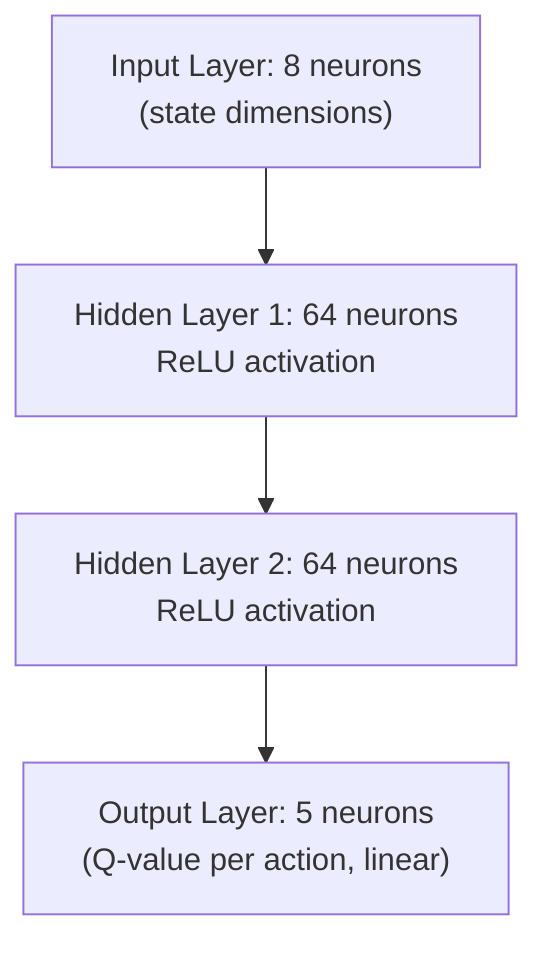

# Double DQNアーキテクチャ

Promovolveは**Double DQN**（Van Hasselt et al., 2016）を、外部MLフレームワークへの依存のないカスタムの純粋Scalaニューラルネットワーク実装で使用しています。

## 過大推定問題

標準的なDQNは同じネットワークを使って最良のactionの選択と評価の両方を行います：

```
target = reward + γ × max_a Q(s', a; θ)
```

`max`演算子は正のバイアスを導入します：ノイズの多いQ-valueがピーク値で選択され、系統的に過大推定されます。多くの更新にわたってこれが蓄積され、過度に楽観的なQ-valueと最適でない方策（例：過剰入札）につながります。

## Double DQNの解決策

選択と評価を分離します：

```
a* = argmax_a Q(s', a; θ)             ← Q-network selects action
target = reward + γ × Q(s', a*; θ⁻)    ← Target network evaluates it
```

θとθ⁻は異なるパラメータを持つため、ノイズが独立し、相関が断ち切られます。

## ネットワークアーキテクチャ（DenseNetwork.scala）



Q-networkとtarget networkの両方がこのアーキテクチャを共有しています。

### 重みの初期化
**Xavier initialization**（ガウスサンプリング）：
```
scale = sqrt(2.0 / fanIn)
weight = rng.nextGaussian() × scale
```

### フォワードパス
レイヤーの順次計算：
- 隠れ層：`output = ReLU(W × input + bias)` ここで `ReLU(x) = max(0, x)`
- 出力層：`output = W × input + bias`（線形、活性化関数なし）

### Backpropagation
MSE損失による標準的なSGD：
```
loss = sum((output[i] - target[i])²) / outputSize
gradient_output: delta[i] = 2.0 × (output[i] - target[i]) / outputSize
gradient_hidden: delta[k] = if (activation[k] > 0) nextDelta[k] else 0 (ReLU derivative)
weight_update: w[j][k] -= learningRate × delta[j] × activation[k]
bias_update:   b[j] -= learningRate × delta[j]
```

損失は取られたaction（one-hot）にのみ適用されます。

## Target Networkの同期

```scala
if (trainSteps % targetSyncInterval == 0):
    targetNetwork.copyFrom(qNetwork)  // Full weight copy via System.arraycopy
```

エージェント作成時の初期同期により、両方のネットワークが同一の状態で開始することが保証されます。

## Q-Valueのクリッピング

```scala
target[action] = clamp(-qClip, qClip, target[action])
```

デフォルトの`qClip = 100.0`。学習初期の発散に対する安全対策です。

## なぜ純粋Scalaなのか？

DQN実装はTensorFlow、PyTorch、DL4Jに依存しません：
- **デプロイのシンプルさ**：ネイティブライブラリへの依存なし、任意のJVMで実行可能
- **統合**：Pekkoアクターシステム内で動作し、プロセス間通信なし
- **スケール**：ネットワークは小さく（8→64→64→5 = 約4,800パラメータ）、フレームワークのオーバーヘッドが支配的になる
- **永続化**：重みは`Array[Double]`としてシリアライズされ、キャンペーンデータとともにPekkoの耐久状態に保存される
