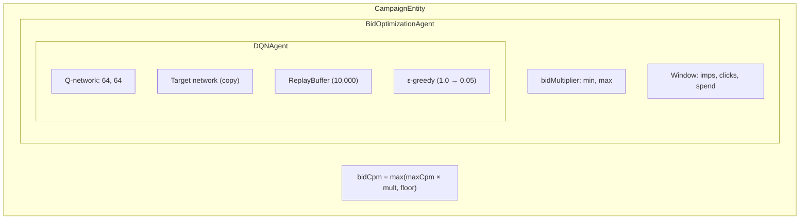

# DQN Agent概要

Promovolveの各キャンペーンは、キャンペーンのbid multiplierを時間とともに調整する独自の**Double DQN強化学習エージェント**を持っています。エージェントは15分ごとにキャンペーンのパフォーマンス指標を観測し、入札を調整するactionを出力します。

## アーキテクチャ



## 2つの速度パス

### 高速パス（入札リクエストごと）
```
1. Receive CampaignBidRequest
2. Check budget, eligibility, size match
3. Compute: bidCpm = max(maxCpm × bidMultiplier, floorCpm)
4. Return CampaignBidResponse with eligible creatives
```

RL計算なし — `bidMultiplier`はキャッシュされたスカラー値です。

### 低速パス（15分ごと）
```
1. Timer fires (rlObserveInterval = 15 minutes)
2. Compute timeRemaining = max(0, 1.0 - elapsed / rlDayDurationSeconds)
3. Call bidOptAgent.observe(observation)
   a. Build 8-dimensional state vector
   b. Compute reward from previous window
   c. Store transition (s, a, r, s') in replay buffer
   d. Select action via ε-greedy
   e. Apply action: adjust bidMultiplier
   f. Train DQN on batch from replay buffer
4. Reset window counters
```

### イベント記録（リクエストごと）
```
recordImpression(spendAmount)  → accumulates window metrics
recordClick()                   → increments window click counter
recordBidOpportunity(won)       → tracks win rate
```

## 日のリセット

日次予算ロールオーバー時：
1. `done=true`で**終端遷移**を保存（最終reward = 最後のウィンドウのクリック数）
2. `bidMultiplier`を1.0にリセット
3. ウィンドウカウンターと日次統計をリセット
4. DQNの重みは**保持** — 学習した方策は日をまたいで引き継がれる
5. ガード：`lastRolledEpochDay`が同じ暦日での二重ロールを防止

## Inferenceモード

```scala
val action = if (inferenceOnly)
  dqn.selectGreedy(state)   // Pure exploitation, no exploration
else
  dqn.selectAction(state)    // ε-greedy (training mode)
```

`inferenceOnly`フラグにより、学習済みエージェントをさらなるexplorationなしでデプロイできます。

## 永続化

DQNエージェントの状態は`DQNAgent.Snapshot`（重み、バイアス、epsilon、ステップカウンター）としてシリアライズされ、`CampaignEntity.State.rlSnapshot`に保存されます。これはプロセスのクラッシュと再起動に耐え — エージェントは中断した場所から学習を再開します。
