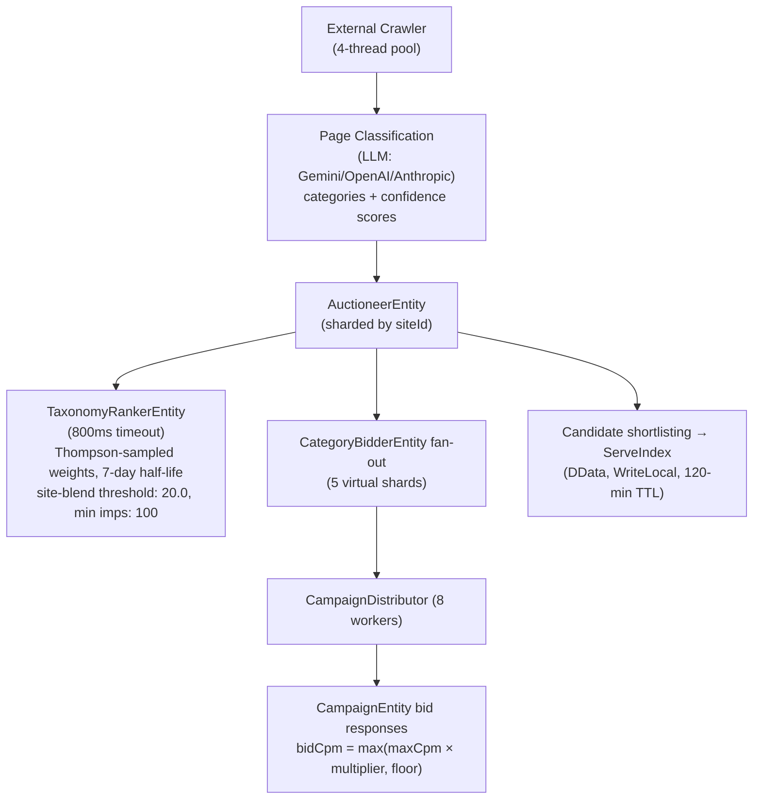
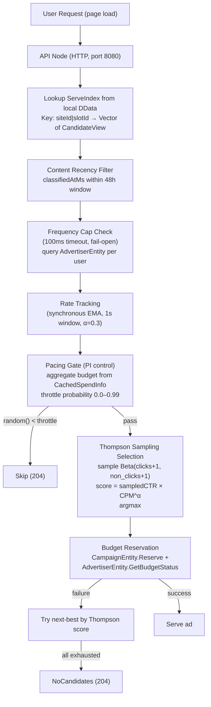

# Data Flow: Crawl vs Serve

Promovolve separates its workload into two distinct phases with fundamentally different performance characteristics.

## Crawl Phase (Write Path)

The crawl phase runs on a configurable schedule (default: Quartz cron `"0 0 2 * * ?"` — 2am daily) and is the "heavy" computation path. Crawl configuration per site includes `maxDepth` (default: 2) and `concurrency` (default: 5), running on a dedicated `crawler-dispatcher` with 4 fixed threads.

## Serve Phase (Read Path)

The serve phase handles every ad request and must be extremely fast.

## Why Two Phases?

| Concern | Crawl Phase | Serve Phase |
|---------|-------------|-------------|
| Latency | Seconds OK | Must be < 1ms |
| Computation | Full auction, LLM classification | Cache lookup + Beta sampling |
| Fan-out | Many entities | Zero (local DData) |
| Failure mode | Retry on next crawl | Serve cached candidates |
| Scaling | Add entity nodes | Add API nodes |
| Dispatcher | `crawler-dispatcher` (4 threads) | Default Pekko dispatcher |

This separation means:
1. **Auction complexity doesn't affect serve latency** — LLM classification and multi-entity fan-out happen in the background
2. **Serve capacity scales independently** — adding API nodes increases request throughput without affecting auction load
3. **Temporary failures are invisible to users** — cached candidates remain in ServeIndex until their 120-minute TTL expires
