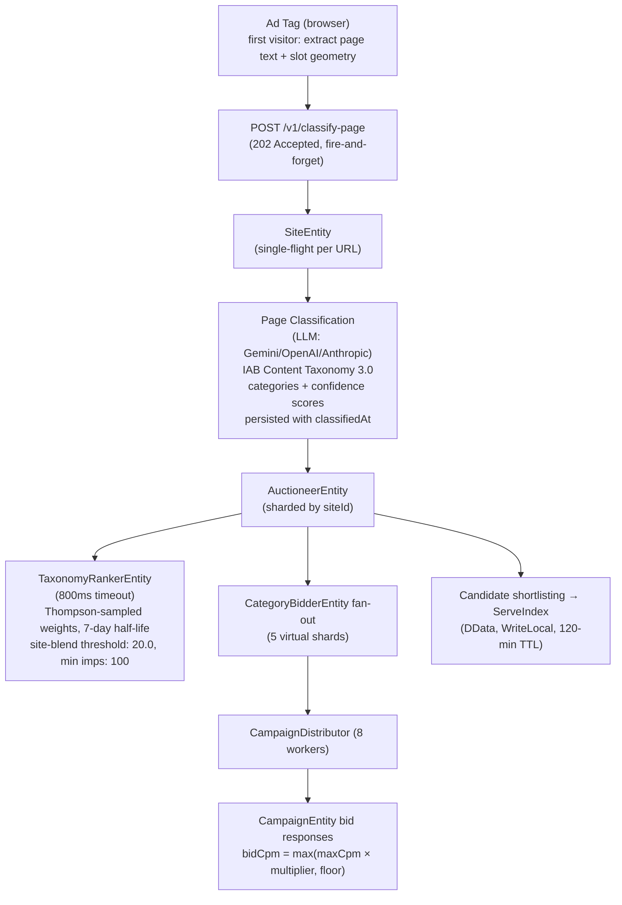
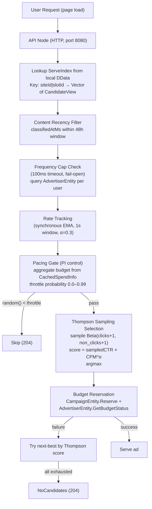

# Data Flow: Classify vs Serve

Promovolve separates its workload into two distinct phases with fundamentally different performance characteristics.

## Classify Phase (Write Path)

The classify phase is traffic-driven, not scheduled — there is no crawler and no cron. When a page's first visitor arrives and the serve misses, the ad tag itself extracts the live page's text and slot geometry in the browser and POSTs it to `/v1/classify-page`. The endpoint replies `202 Accepted` immediately and hands the payload to the SiteEntity, which single-flights classification per URL (concurrent visitors don't trigger duplicate LLM calls). This is the "heavy" computation path, and it never blocks a serve.

Freshness is governed by a token: every serve response carries `reclassifyInMs`, computed from the publisher's content-recency window (default 48 hours, publisher-configurable). Fresh pages don't re-classify on every serve; only when the window lapses does the ad tag send text again.

The durable copy of classifications lives in `SiteEntity.pageClassifications`; the AuctioneerEntity keeps an in-memory `lastPage` map (categories, slots, `classifiedAt`) for re-auctions, reseeded at boot via `RestoreClassifications` and recovered per-URL when a `Reevaluate` misses. Beyond the first classification, the auction re-runs event-driven (campaign approve/pause, budget changes — on a 1-second debounce) with a periodic backstop.

A page nobody visits never classifies — and has no impressions to sell, so no work is wasted.

## Serve Phase (Read Path)

The serve phase handles every ad request and must be extremely fast.

## Why Two Phases?

| Concern | Classify Phase | Serve Phase |
|---------|----------------|-------------|
| Latency | Seconds OK | Must be < 1ms |
| Computation | Full auction, LLM classification | Cache lookup + Beta sampling |
| Fan-out | Many entities | Zero (local DData) |
| Failure mode | Next visitor re-triggers (single-flight releases) | Serve cached candidates |
| Scaling | Add entity nodes | Add API nodes |
| Trigger | First visitor / freshness token lapse | Every ad request |

This separation means:
1. **Auction complexity doesn't affect serve latency** — LLM classification and multi-entity fan-out happen in the background
2. **Serve capacity scales independently** — adding API nodes increases request throughput without affecting auction load
3. **Temporary failures are invisible to users** — cached candidates remain in ServeIndex until their 120-minute TTL expires
