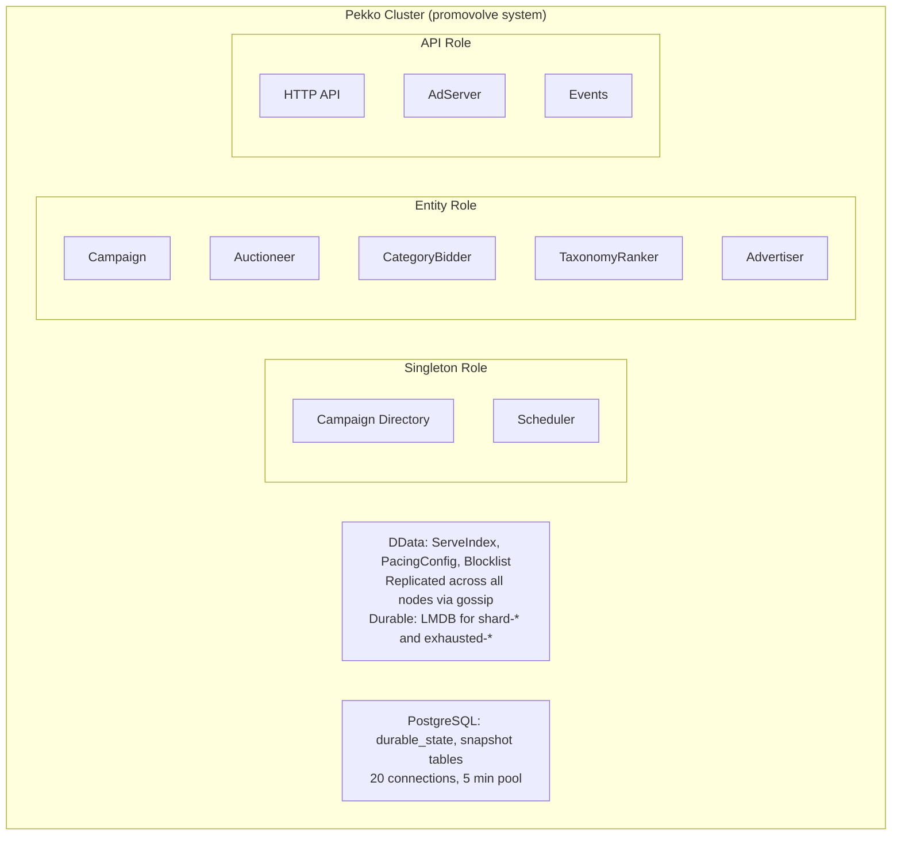

# System Architecture

Promovolve runs as an Apache Pekko Cluster with three distinct node roles, Cluster Sharding for entity distribution, and Distributed Data (DData) for replicated in-memory state. Persistence uses PostgreSQL via JDBC (Slick).

## High-Level Components

## Cluster Configuration

From `application.conf`:

| Setting | Value |
|---------|-------|
| Cluster roles | `singleton`, `entity`, `api` (env: `PEKKO_CLUSTER_ROLES`) |
| Number of shards | 100 |
| Remember entities | on (via DData store) |
| Passivation timeout | 5 minutes |
| Split-brain strategy | `keep-majority` (stable after 20s) |
| Heartbeat interval | 1s, threshold 12.0, acceptable pause 10s |
| Remote frame size | 256 KiB |
| Seed node | `pekko://promovolve@127.0.0.1:25520` |

## DData Configuration

| Setting | Value |
|---------|-------|
| Gossip interval | 2s |
| Notify subscribers interval | 500ms |
| Max delta elements | 500 |
| Durable keys | `shard-*`, `exhausted-campaigns` |
| Durable store | LMDB (100 MiB map, 200ms write-behind) |
| Pruning interval | 120s (dissemination: 300s) |

## Key Design Decisions

1. **100 shards** with remember-entities-via-DData ensures entities survive node restarts and are automatically rebalanced (rebalance-absolute-limit: 20, relative: 0.1).

2. **DData for ServeIndex** means every API node has a local replica of all active ad candidates. Serve-time lookups never cross the network.

3. **LMDB durability** for shard metadata and exhausted-campaigns state, but ServeIndex itself is ephemeral — rebuilt from auctions on restart.

4. **Separation of roles** allows scaling read (API) and write (entity) workloads independently. The singleton role hosts cluster-wide coordinators like CampaignDirectory.
