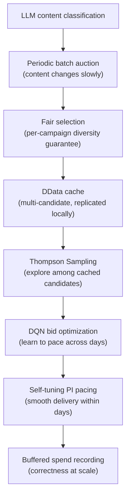

# Key Innovations

Promovolve's design choices form a coherent system where each innovation enables the next.

## 1. Content-Based, Not User-Based

**Traditional**: User profiles, cookies, device fingerprinting power ad targeting.

**Promovolve**: Targeting uses **LLM-based content classification** (Gemini/OpenAI/Anthropic) to match ads to page topics. No user tracking, no cookies.

**Why it matters**: Privacy-preserving (no GDPR/CCPA data collection), simpler infrastructure (no profile database), content-value alignment (ads match what the user is currently reading).

## 2. Recency-Only Monetization

**Traditional**: Ads on any page, regardless of publication date.

**Promovolve**: Only content within the **48-hour recency window** participates. AuctioneerEntity prunes older classifications every 5 minutes.

**Why it matters**: Fresh content has higher engagement → higher CTR → better outcomes for all participants. Reduces low-quality inventory.

## 3. Periodic Batch Auctions

**Traditional**: One auction per page load.

**Promovolve**: One auction per crawl (scheduled via Quartz cron) + 5-minute re-auctions.

**Why it matters**: Decouples auction cost from traffic. Sub-millisecond serving via DData local replica. Enables multi-candidate caching.

## 4. Fair Selection + Multi-Candidate MAB

**Traditional**: Single winner per auction.

**Promovolve**: Per-campaign diversity guarantee at auction time (one creative per campaign first), then Thompson Sampling explores among cached candidates at serve time.

**Why it matters**: Discovers which creative actually engages users. Graceful degradation on budget exhaustion. Self-correcting (poor creatives lose share naturally).

## 5. Pure-Scala Double DQN

**Traditional**: DSPs use bid-shading algorithms (often in Python/C++ ML frameworks).

**Promovolve**: Each campaign has a dedicated Double DQN agent (8→64→64→5, ~4,800 parameters) implemented in pure Scala. No TensorFlow, no PyTorch.

**Why it matters**: Lives inside the Pekko actor, no inter-process communication. Weights serialize as `Array[Double]` in CampaignEntity state. JVM-only deployment.

## 6. Self-Tuning PI Pacing

**Traditional**: Simple rules ("spend X% by noon") or fixed-gain controllers.

**Promovolve**: PI controller with:
- **Adaptive gains** scaled by traffic volatility (CV)
- **Self-tuning overpace multiplier** (1.5x-5.0x, adjusts every 20 samples)
- **Oscillation detection** (stddev threshold 0.08 → dampening)
- **Leaky integrator** (decay 0.995, anti-windup)
- **Cross-day learning** (boosts multiplier if budget exhausted early)
- **Traffic shape awareness** (separate weekday/weekend 24-hour profiles)

**Why it matters**: Adapts to any traffic pattern without manual tuning. Learns from past days' mistakes.

## 7. Buffered At-Least-Once Spend Recording

**Traditional**: Database writes per impression.

**Promovolve**: Spend events buffered (500ms timer OR batch of 20), deduplicated via Bloom filter (50K entries, 0.01% FPP), at-least-once delivery with exponential backoff retries.

**Why it matters**: Reduces persistence load by ~20x while maintaining correctness guarantees.

## The Unified Picture

Each choice enables the next. Remove one, and the system loses coherence. Together, they create an ad platform that is fast, learning, privacy-preserving, and publisher-aligned.
