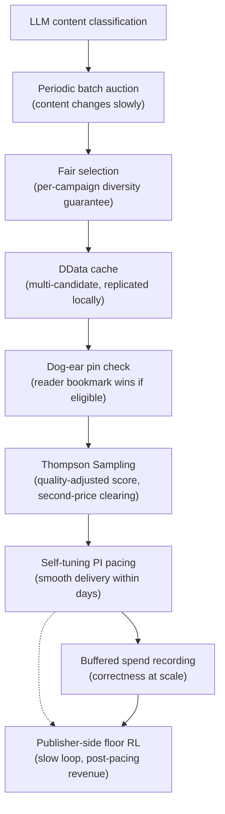

# Key Innovations

Promovolve's design choices form a coherent system where each innovation enables the next.

## 1. The Magazine Format

**Traditional**: Static rectangles in fixed IAB pixel sizes (300×250, 728×90, 970×250).

**Promovolve**: Expandable, multi-page creatives. The collapsed view sits in the publisher's slot like a magazine ad on a page; tapped, it opens into a full-screen overlay the reader can swipe through (cover, story pages, call to action), then collapses again.

**Why it matters**: Attention is given, not stolen. The advertiser pays for an impression; if the reader chooses to expand, the advertiser earns engaged time. Print-style creative work translates directly. And because the format is a container, not a fixed pixel size, a single creative renders into any slot the publisher offers (see §2).

## 2. Fluid Creatives

**Traditional**: Creatives are pinned to specific IAB dimensions. Mismatched slots get letterboxing, scaling artifacts, or no fill.

**Promovolve**: One creative reflows to fit whatever rectangle the publisher provides. The pipeline (Playwright extraction from a landing page → Gemini rewriting → in-house designer rendering) outputs a layout the slot's geometry drives at serve time.

**Why it matters**: Advertisers stop maintaining N variants of every creative. Publishers stop forcing slot dimensions to match available inventory. Small-business advertisers — who never had the resources for N-variant production — can participate.

## 3. The Dog-Ear (Reader Bookmarks)

**Traditional**: Readers can't influence which ads they see. Retargeting is an advertiser-controlled chase.

**Promovolve**: Readers fold the corner of a creative they want to remember; the next time that advertiser is eligible on a page they visit, the bookmarked creative is the one served. The pin lives in the reader's browser (IndexedDB) and is signed by a stateless `FoldToken` so the server never stores who folded what.

**Why it matters**: An explicit reader vote is more reliable than any inferred preference, and it puts agency on the right side of the table. Pinned re-encounters bypass auction reservation and pacing throttle — the system treats them as free engagement signals.

## 4. Content-Based, Not User-Based

**Traditional**: User profiles, cookies, device fingerprinting power ad targeting.

**Promovolve**: Targeting uses **LLM-based content classification** (Gemini/OpenAI/Anthropic) to match ads to page topics. No user tracking, no cookies.

**Why it matters**: Privacy-preserving (no GDPR/CCPA data collection), simpler infrastructure (no profile database), content-value alignment (ads match what the user is currently reading).

## 5. Recency-Only Monetization

**Traditional**: Ads on any page, regardless of publication date.

**Promovolve**: Only content within the **48-hour recency window** participates. AuctioneerEntity prunes older classifications every 5 minutes.

**Why it matters**: Fresh content has higher engagement → higher CTR → better outcomes for all participants. Reduces low-quality inventory.

## 6. Periodic Batch Auctions

**Traditional**: One auction per page load.

**Promovolve**: One auction per crawl (scheduled via Quartz cron) + 5-minute re-auctions.

**Why it matters**: Decouples auction cost from traffic. Sub-millisecond serving via DData local replica. Enables multi-candidate caching.

## 7. Fair Selection + Multi-Candidate MAB

**Traditional**: Single winner per auction.

**Promovolve**: Per-campaign diversity guarantee at auction time (one creative per campaign first), then Thompson Sampling explores among cached candidates at serve time.

**Why it matters**: Discovers which creative actually engages users. Graceful degradation on budget exhaustion. Self-correcting (poor creatives lose share naturally).

## 8. Quality-Adjusted Second-Price Clearing

**Traditional**: Highest bid wins; second-price (Vickrey) is the gold standard but ignores creative quality.

**Promovolve**: Score is `sampledCTR × CPM^α` (α publisher-tunable). The exploiting winner pays the minimum CPM that would still have beaten the runner-up given its sampled CTR — a *quality-adjusted* second price.

**Why it matters**: A creative readers click outscores one that merely bids high. There's no upside to bid shading, so Promovolve runs no campaign-side bid optimizer at all — the auction mechanism itself extracts honest bids.

## 9. Self-Tuning PI Pacing

**Traditional**: Simple rules ("spend X% by noon") or fixed-gain controllers.

**Promovolve**: PI controller with:
- **Adaptive gains** scaled by traffic volatility (CV)
- **Self-tuning overpace multiplier** (1.5×–5.0×, adjusts every 20 samples)
- **Oscillation detection** (stddev threshold 0.08 → dampening)
- **Leaky integrator** (decay 0.995, anti-windup)
- **Cross-day learning** (boosts multiplier if budget exhausted early)
- **Traffic shape awareness** (separate weekday/weekend 24-hour profiles)

**Why it matters**: Adapts to any traffic pattern without manual tuning. Learns from past days' mistakes.

## 10. Publisher-Side Floor RL

**Traditional**: Floors are static or set by exchange-side heuristics outside the publisher's view.

**Promovolve**: A per-site RL agent tunes the publisher's minimum floor CPM based on observed bid spread and post-pacing served revenue. Activates only when bid spread is wide enough to make floor adjustments meaningful (>1.5×).

**Why it matters**: The publisher's tool, not the exchange's. Honest second-price clearing for advertisers; floor optimization for the publisher.

## 11. Buffered At-Least-Once Spend Recording

**Traditional**: Database writes per impression.

**Promovolve**: Spend events buffered (500ms timer OR batch of 20), deduplicated via Bloom filter (50K entries, 0.01% FPP), at-least-once delivery with exponential backoff retries.

**Why it matters**: Reduces persistence load by ~20× while maintaining correctness guarantees.

## The Unified Picture

Each choice enables the next. Remove the magazine format and the dog-ear has nowhere to live; remove fluid creatives and the format collapses back to fixed-size banners; remove quality-adjusted clearing and bid shading returns. Together, they create an ad platform that is fast, learning, privacy-preserving, reader-respectful, and publisher-aligned.
