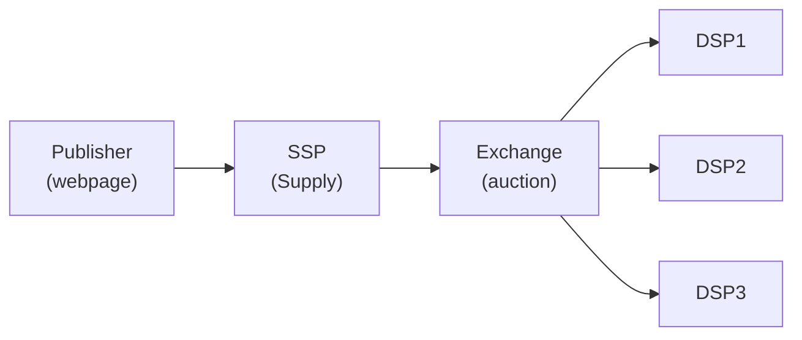
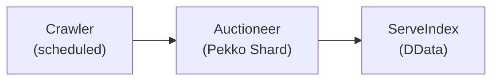
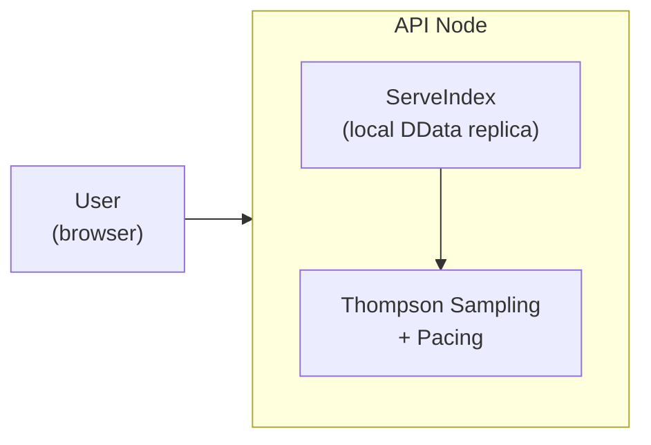

# Promovolve vs SSP/DSP/Exchange

This chapter maps Promovolve's design choices against the traditional programmatic advertising stack.

## Traditional Programmatic Stack

**Flow**: User loads page → SSP sends bid request → Exchange broadcasts to DSPs → DSPs respond within 100ms → Highest bid wins → Ad served.

## Promovolve Stack

Promovolve collapses the SSP, DSP, and exchange into a single system with two distinct phases: an **offline auction phase** that runs ahead of time, and an **online serve phase** that responds to user requests.

### Phase 1: Offline Auction (no user present)

1. **Crawler** periodically fetches publisher pages and sends them to an LLM (Gemini Flash) for content classification into IAB taxonomy categories.
2. **AuctioneerEntity** — one per site, sharded across the Pekko cluster — runs a batch auction. It collects bids from all campaigns whose target categories match the page content, applies pacing throttles, and shortlists multiple candidates per ad slot (not just a single winner). Bids are honest CPMs; quality-adjusted second-price clearing at serve time means there's no upside to bid shading, so no campaign-side bid optimizer is needed.
3. **ServeIndex** — a replicated in-memory cache built on Pekko Distributed Data (DData) — stores the shortlisted candidates. Every node in the cluster holds a local replica, so no remote call is needed at serve time.

This phase re-runs on a schedule (every 5 minutes by default) and whenever content changes, keeping candidates fresh without waiting for a user to arrive.

### Phase 2: Online Serve (user arrives)

The ServeIndex is not a separate service — it's a DData-replicated data structure, and every API node holds a local replica in its own process memory. There is no network call between the API node and the ServeIndex; it's a local in-memory lookup.

1. **User** requests an ad for the page they're viewing.
2. **API Node** reads pre-computed candidates directly from its local ServeIndex replica — no network hop, no auction, no external call.
3. **Thompson Sampling** selects among the shortlisted candidates, balancing exploration of new creatives against exploitation of known performers. A pacing check ensures the selected campaign hasn't exhausted its budget for this time window.

The result: serve latency under 1ms, with no user data collected, no cookies set, and no third-party calls made.

### What replaced what

| Traditional role | Promovolve equivalent |
|---|---|
| SSP (supply-side platform) | Crawler + AuctioneerEntity — the publisher's inventory is discovered by crawling, not by firing bid requests |
| Exchange (auction house) | AuctioneerEntity + Thompson Sampling at serve time — quality-adjusted second-price clearing |
| DSP (demand-side platform) | Campaign entities — advertisers post a CPM and the auction extracts honest bids; no separate bid-management system |
| Ad server | API Node + local DData replica — serves pre-computed results from memory |
| DMP (data management platform) | Not needed — targeting is content-based, not user-based |
| Creative-production pipeline | LP-to-creative pipeline — Playwright extraction + Gemini rewriting + in-house designer renders fluid creatives that flow to fit the slot |
| Retargeting | Dog-ear pin — reader-driven bookmark stored in the reader's own browser, not a server-side profile |

## Summary Comparison

| Aspect | Traditional SSP/DSP | Promovolve |
|--------|-------------------|------------|
| Ad format | Static IAB rectangles (300×250, 728×90, …) | Expandable, multi-page magazine creatives that flow to fit the slot |
| Reader agency | None | Dog-ear pin — reader bookmarks an ad to revisit |
| Auction timing | Per-request (realtime) | Per-crawl + 5-min re-auction |
| Serve latency | 50–200ms | < 1ms |
| Winner selection | Highest bid wins | Fair selection → Thompson Sampling |
| Price model | Second-price (GSP) on bids only | Quality-adjusted second-price: `sampledCTR × CPM^α` |
| Price discovery | Yes (competitive) | Yes (competitive, quality-adjusted) |
| Learning | RTB feedback loops | TS + category ranking + traffic shape + publisher-side floor RL |
| Candidate model | Single winner | Multi-candidate with diversity |
| Budget control | Per-campaign throttling | Aggregate PI-controlled pacing |
| State persistence | Database/Redis | DData (replicated in-memory) |
| Content scope | Any page, any time | Recency only (< 48h) |
| Targeting | User profiles, cookies | Content classification (LLM) |
| Failure mode | No ad shown | Serve cached candidates |
| Privacy | User tracking required | No user profiles; even pins live in the reader's browser |

The following sub-chapters explore each difference in detail.
