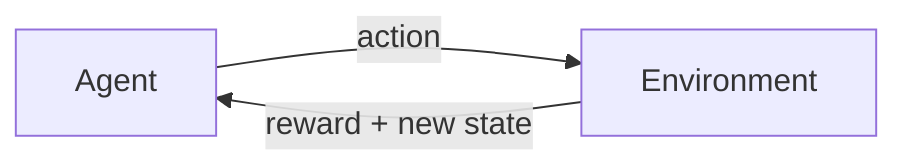

# RL Fundamentals: Agent, Environment, Reward

Reinforcement learning has a clean conceptual framework. Once you understand its four key pieces, everything else --- Q-learning, neural networks, exploration strategies --- becomes a detail of *how* rather than *what*.

Here is the loop:



1. The **agent** observes the current **state** of the world.
2. The agent chooses an **action**.
3. The environment responds with a **reward** (a number: higher is better) and a **new state**.
4. Repeat.

The agent's goal is to choose actions that maximize the total reward it accumulates over time. Not just the immediate reward --- the *cumulative* reward, including what it expects to earn in the future.

That is it. That is the entire framework. Let us now map each piece to the floor price optimization problem.

## Agent: FloorCpmOptimizationAgent

In Promovolve, each publisher site gets its own `FloorCpmOptimizationAgent`. This is the agent. It wakes up every 15 minutes, looks at how the site's ad inventory has been performing, and decides whether to increase, decrease, or hold the floor price.

The agent does not see individual ad requests. It does not know which users saw which ads. It sees only aggregate metrics from the last 15-minute window: fill rate, average winning CPM, served revenue, bidder count, budget exhaustion rate. This is deliberate --- the agent operates on a coarse time scale, making strategic pricing decisions, not tactical ones.

## Environment: the advertiser marketplace

The environment is everything *outside* the agent's control: how many advertisers are bidding, their CPM levels, their budgets, user traffic patterns, creative quality. The agent cannot observe the environment directly; it only sees the environment's *effects* through the metrics it receives.

This is a crucial distinction. The agent does not know that a new advertiser just entered the market bidding $10. What it *does* know is that the average winning CPM jumped from $3 to $5 in the last window. It must figure out the right response from that indirect signal.

## State: what the agent observes

Every 15 minutes, the agent constructs a 7-dimensional state vector from the site's current metrics. Each dimension is a number, normalized to a range around 0 to 2. Here is the `toState()` method from `FloorCpmOptimizationAgent.scala`:

```scala
private def toState(): Array[Double] = {
  val maxCpm = if (windowMaxCpm > 0) windowMaxCpm else 1.0
  val fillRate = if (windowAuctions > 0) windowFilled.toDouble / windowAuctions else 0.0
  val avgWinCpm = if (windowFilled > 0) windowTotalWinCpm / windowFilled else 0.0
  val avgBidders = if (windowAuctions > 0) windowTotalBidders.toDouble / windowAuctions else 0.0
  val servedRevPerAuction = if (windowAuctions > 0) windowServedRevenue / windowAuctions else 0.0
  val rejRate = if (windowTotalBids > 0) windowRejections.toDouble / windowTotalBids else 0.0
  val totalServeAttempts = windowServedImpressions + windowBudgetExhausted
  val budgetExhaustionRate = if (totalServeAttempts > 0) windowBudgetExhausted.toDouble / totalServeAttempts else 0.0

  Array(
    math.min(2.0, if (maxCpm > 0) _currentFloor / maxCpm else 0.5),
    fillRate,
    math.min(5.0, if (_currentFloor > 0) avgWinCpm / _currentFloor else 1.0),
    math.min(2.0, avgBidders / 10.0),
    math.min(3.0, if (_currentFloor > 0) servedRevPerAuction / (_currentFloor / 1000.0) else 0.0),
    rejRate,
    budgetExhaustionRate
  )
}
```

Let us walk through each dimension and why it matters.

### Dimension 0: currentFloor / maxObservedCPM

Where is the floor relative to the market? If the floor is $3 and the highest bid is $10, this is 0.3 — plenty of room. If the floor is $8 and the highest bid is $10, this is 0.8 — dangerously close to pricing everyone out.

**Why it matters:** The agent needs to know its own position to reason about whether to move up or down.

### Dimension 1: fillRate

The fraction of auctions that produced a winner. If 100 auctions ran and 80 had at least one qualifying bidder, fill rate is 0.8.

**Why it matters:** Fill rate is the most direct signal of whether the floor is too high. A dropping fill rate means the floor is rejecting too many bidders.

### Dimension 2: avgWinningCPM / currentFloor

How far above the floor are winners bidding? If the floor is $2 and the average winning CPM is $6, this ratio is 3.0 — winners are bidding well above the floor, which means the floor could probably be higher.

**Why it matters:** A high ratio suggests the floor is leaving money on the table. A ratio near 1.0 means winners are barely clearing the floor — the floor might be too high.

### Dimension 3: avgBidderCount

The average number of bidders per auction, normalized by 10. Three bidders gives 0.3; ten bidders gives 1.0.

**Why it matters:** More bidders means more competition, which naturally drives up clearing prices. The agent can learn that in high-competition environments, it can raise the floor without losing fill rate.

### Dimension 4: servedRevenue (normalized)

The actual revenue per auction from served impressions, normalized by the floor price. This is the ground truth signal — what the publisher actually earned, not what the auction promised.

**Why it matters:** This is the number the agent is ultimately trying to maximize. Using served revenue (not auction-time clearing prices) accounts for pacing throttle — if impressions never actually serve, they don't count.

### Dimension 5: rejectionRate

The fraction of bids rejected because the campaign's CPM is below the floor.

**Why it matters:** This tells the agent exactly how many advertisers the floor is blocking. A high rejection rate with low fill rate means the floor is too aggressive.

### Dimension 6: budgetExhaustionRate

The fraction of serve attempts denied because the campaign's budget was exhausted.

**Why it matters:** This is the delayed consequence of a high floor. When only one bidder remains (others rejected by floor), that sole bidder pays floor price on every impression. Higher floor → higher per-impression cost → faster budget drain → budget exhaustion. The agent sees this signal before revenue drops to zero.

### Why normalization matters

Every dimension is capped and normalized. Fill rate stays in [0, 1]. Bidder count is divided by 10. Revenue is divided by the floor baseline. This is important because neural networks work best when inputs are in similar numeric ranges.

## Action: 7 discrete floor adjustments

When the agent observes a state, it must choose one of 7 actions. Each action maps to a multiplicative adjustment applied to the current floor:

| Action | Multiplier | Meaning |
|:---:|:---:|:---|
| 0 | × 0.90 | Drop floor 10% — let more bidders in |
| 1 | × 0.95 | Drop floor 5% — slight relaxation |
| 2 | × 0.98 | Drop floor 2% — fine-tune down |
| 3 | × 1.00 | Hold current floor |
| 4 | × 1.02 | Raise floor 2% — fine-tune up |
| 5 | × 1.05 | Raise floor 5% — slight tightening |
| 6 | × 1.10 | Raise floor 10% — filter out low bidders |

The floor is clamped to `[publisherMinFloor, maxObservedCPM × 0.80]`:

```scala
val effectiveMax = if (maxObservedCpmEver > 0)
  math.min(config.maxFloorCpm, maxObservedCpmEver * config.maxFloorFraction)
else config.maxFloorCpm
_currentFloor = math.max(
  _minFloor,
  math.min(effectiveMax, _currentFloor * adjustment)
)
```

The 80% cap is crucial. Without it, the agent could push the floor above all bids, killing all revenue. With the cap, at least one bidder always remains competitive.

Why **discrete** actions instead of a continuous output? Two reasons. First, discrete action spaces are simpler to learn with DQN. Second, discrete actions make the agent's behavior interpretable --- you can look at a log and see "the agent chose action 6 (raise floor 10%)" rather than "the agent output 1.0847."

## Reward: what success looks like

The reward function encodes *what you want the agent to optimize for*. Get it right, and the agent learns useful behavior. Get it wrong, and the agent finds creative ways to maximize the number you gave it while doing something you did not intend.

Here is the `computeReward()` method:

```scala
private def computeReward(): Double = {
  val fillRate = if (windowAuctions > 0) windowFilled.toDouble / windowAuctions else 0.0
  val servedRevPerAuction = if (windowAuctions > 0) windowServedRevenue / windowAuctions else 0.0
  val baseline = if (_currentFloor > 0) _currentFloor / 1000.0 else 0.0005
  val normalizedRevenue = if (baseline > 0) servedRevPerAuction / baseline else 0.0

  val revenueReward = normalizedRevenue * fillRate

  val emptyPenalty = if (fillRate < 0.5)
    config.emptyAuctionPenaltyWeight * (0.5 - fillRate)
  else 0.0

  val totalServeAttempts = windowServedImpressions + windowBudgetExhausted
  val budgetExhaustionRate = if (totalServeAttempts > 0) windowBudgetExhausted.toDouble / totalServeAttempts else 0.0
  val budgetPenalty = config.budgetExhaustionPenaltyWeight * budgetExhaustionRate

  val volatilityPenalty = if (_prevFloor > 0)
    config.volatilityPenaltyWeight * math.abs(_currentFloor - _prevFloor) / _prevFloor
  else 0.0

  revenueReward - emptyPenalty - volatilityPenalty - budgetPenalty
}
```

### Primary reward: revenue × fill rate

The normalized revenue multiplied by fill rate. This provides a gradient signal even when revenue is zero — if the floor is slightly too high, fill rate drops to 0.6 and the reward decreases proportionally, rather than suddenly falling off a cliff.

### Penalty: empty auctions

When fill rate drops below 50%, a linear penalty kicks in. This tells the agent "you are losing too many bidders."

### Penalty: budget exhaustion (weight = 2.0)

The strongest penalty. When advertisers' budgets exhaust because the floor is too high (high per-impression cost → fast budget drain), this penalty fires. It provides an early warning before revenue drops to zero.

### Penalty: volatility

A proportional penalty for large floor changes. Publishers and advertisers need price stability — a floor that jumps 20% every 15 minutes is disruptive.

## Episode structure

In many RL problems, there is a clear episode boundary — the game ends, the maze is solved, the robot reaches a goal. In floor optimization, episodes are less defined. The agent runs continuously, and the market never truly "resets."

In practice, day boundaries serve as soft episode markers. At the end of each day:
- Budget counters reset
- Traffic patterns restart their daily cycle
- The agent stores a terminal transition and continues

The agent's learned weights persist across episodes — it does not start fresh each day. This means the agent accumulates long-term market knowledge while adapting to daily fluctuations.

## What is ahead

In the next chapter, we will build a neural network from scratch — no TensorFlow, no PyTorch, just arrays and arithmetic. This network will learn to estimate how valuable each action is in each state, which is the foundation of the DQN algorithm the floor agent uses.
