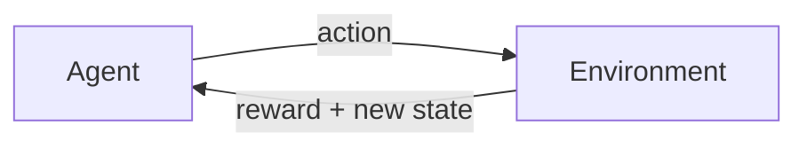
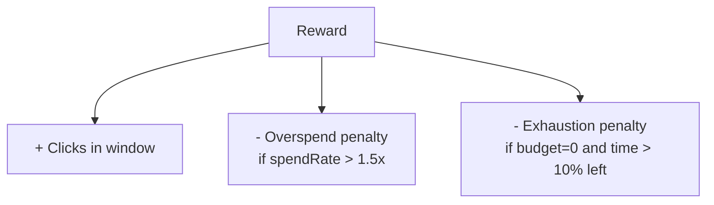
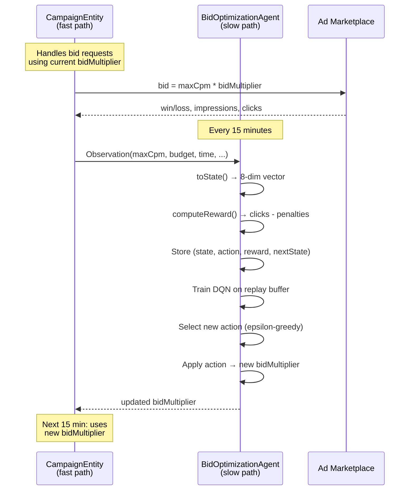

# RL Fundamentals: Agent, Environment, Reward

Reinforcement learning has a clean conceptual framework. Once you understand its four key pieces, everything else --- Q-learning, neural networks, exploration strategies --- becomes a detail of *how* rather than *what*.

Here is the loop:



1. The **agent** observes the current **state** of the world.
2. The agent chooses an **action**.
3. The environment responds with a **reward** (a number: higher is better) and a **new state**.
4. Repeat.

The agent's goal is to choose actions that maximize the total reward it accumulates over time. Not just the immediate reward --- the *cumulative* reward, including what it expects to earn in the future.

That is it. That is the entire framework. Let us now map each piece to the ad bidding problem.

## Agent: BidOptimizationAgent

In Promovolve, each campaign gets its own `BidOptimizationAgent`. This is the agent. It wakes up every 15 minutes, looks at how the campaign has been performing, and decides whether to increase, decrease, or hold the bid multiplier.

The agent does not see individual ad requests. It does not know which users clicked or which publishers served the ads. It sees only aggregate metrics from the last 15-minute window: total impressions, total clicks, total spend, win rate. This is deliberate --- the agent operates on a coarse time scale, making strategic decisions, not tactical ones.

## Environment: the ad marketplace

The environment is everything *outside* the agent's control: other advertisers' bids, publisher traffic volume, user behavior, time of day. The agent cannot observe the environment directly; it only sees the environment's *effects* through the metrics it receives.

This is a crucial distinction. The agent does not know that a competitor just increased their bid by 30%. What it *does* know is that its win rate dropped from 0.6 to 0.3 in the last window. It must figure out the right response from that indirect signal.

## State: what the agent observes

Every 15 minutes, the agent constructs an 8-dimensional state vector from the campaign's current metrics. Each dimension is a number, typically normalized to a range around 0 to 2. Here is the `toState()` method from `BidOptimizationAgent.scala`:

```scala
private def toState(obs: Observation): Array[Double] = {
  val maxCpm = if (obs.maxCpm > 0) obs.maxCpm else 1.0
  val dailyBudget = if (obs.dailyBudget > 0) obs.dailyBudget else 1.0

  Array(
    // 0: effective CPM (normalized)
    math.min(2.0, (obs.maxCpm * _bidMultiplier) / maxCpm),
    // 1: CTR in window
    if (windowImpressions > 0) math.min(1.0, windowClicks.toDouble / windowImpressions)
    else 0.0,
    // 2: win rate
    if (windowBidOpportunities > 0) windowWins.toDouble / windowBidOpportunities
    else 0.5,
    // 3: budget remaining fraction
    math.max(0.0, math.min(1.0, obs.budgetRemaining / dailyBudget)),
    // 4: time remaining fraction
    math.max(0.0, math.min(1.0, obs.timeRemaining)),
    // 5: spend rate vs ideal (1.0 = on pace)
    spendRate(obs),
    // 6: impression rate (normalized by expected)
    normalizedImpressionRate(obs),
    // 7: CPC (normalized)
    if (windowClicks > 0) math.min(2.0, (windowSpend / windowClicks) / maxCpm)
    else 0.0
  )
}
```

Let us walk through each dimension and why it matters.

### Dimension 0: effectiveCpm

This is the agent's current bid level --- `maxCpm * bidMultiplier`, normalized by `maxCpm` so it always sits around 1.0. This tells the agent "where is my bid right now?" If the multiplier is 1.0, this value is 1.0. If the multiplier is 0.7, this is 0.7.

**Why it matters:** The agent needs to know its own current bid to reason about whether to raise or lower it. Without this, it would have no memory of its previous decisions.

### Dimension 1: ctr (click-through rate)

The ratio of clicks to impressions in the last 15-minute window. If the campaign served 200 impressions and got 4 clicks, CTR is 0.02.

**Why it matters:** CTR is the direct signal of ad quality. If CTR is high, the current bid level is winning good inventory. If CTR drops, the agent might be winning low-quality impressions (cheap but unclicked) or the audience mix has changed.

### Dimension 2: winRate

The fraction of bid opportunities that resulted in a win. If the campaign bid on 500 auctions and won 300, win rate is 0.6.

**Why it matters:** Win rate tells the agent how competitive it is. A low win rate (say 0.1) means the agent is being outbid most of the time --- it might need to increase the multiplier. A very high win rate (say 0.95) might mean the agent is overbidding --- it could lower the multiplier and save budget while still winning plenty of auctions.

### Dimension 3: budgetRemaining

The fraction of the daily budget that has not yet been spent. Starts at 1.0, drops toward 0.0.

**Why it matters:** This is the scarcity signal. If it is 2pm and the budget is already at 0.2, the agent needs to conserve. If it is 2pm and the budget is at 0.8, the agent can afford to be more aggressive.

### Dimension 4: timeRemaining

The fraction of the delivery period remaining. Starts at 1.0 at the beginning of the day, drops to 0.0 at the end.

**Why it matters:** Time context is critical. Having 50% of the budget left means very different things depending on whether 50% or 10% of the day remains. The agent needs both dimensions to reason about pacing.

### Dimension 5: spendRate

The ratio of actual spending pace to the ideal even pace. A value of 1.0 means the campaign is spending exactly on track. A value of 2.0 means it is spending twice as fast as it should. A value of 0.5 means it is under-spending.

This is computed by comparing how much has been spent to how much *should* have been spent given the elapsed time:

```scala
private def spendRate(obs: Observation): Double = {
  if (obs.dailyBudget <= 0 || obs.timeRemaining >= 1.0) return 1.0
  val elapsed = 1.0 - obs.timeRemaining
  if (elapsed <= 0) return 1.0
  val expectedSpend = obs.dailyBudget * elapsed
  if (expectedSpend <= 0) return 1.0
  val actualSpend = obs.dailyBudget - obs.budgetRemaining
  math.min(3.0, actualSpend / expectedSpend) // cap at 3x overspend
}
```

**Why it matters:** This is the single most important pacing signal. It directly tells the agent whether it needs to speed up or slow down. The `budgetRemaining` and `timeRemaining` dimensions give raw position; `spendRate` gives velocity.

### Dimension 6: impressionRate

The number of impressions in the last window, normalized by a baseline expectation of 100 impressions per window.

**Why it matters:** This tells the agent about traffic volume. If impression rate is 2.0, the market is busy --- lots of inventory available. If it is 0.1, traffic is thin. The agent can learn to bid differently depending on market conditions: for example, saving budget during low-traffic periods (when impressions are scarce and expensive) and spending during high-traffic periods (when cheap inventory is plentiful).

### Dimension 7: costPerClick

The average cost per click in the last window, normalized by `maxCpm`.

**Why it matters:** This is an efficiency metric. A high CPC means the agent is paying a lot for each click --- maybe it should bid lower to find cheaper inventory. A low CPC means clicks are coming cheaply --- a good time to be aggressive.

### Why normalization matters

Notice that every dimension is capped and normalized. CTR is capped at 1.0. Effective CPM is capped at 2.0. Spend rate is capped at 3.0. This is important because neural networks work best when inputs are in similar numeric ranges. If one dimension ranged from 0 to 1 and another from 0 to 10,000, the large dimension would dominate training and the small one would be ignored.

## Action: 7 discrete bid adjustments

When the agent observes a state, it must choose one of 7 actions. Each action maps to a multiplicative adjustment applied to the current bid multiplier:

| Action | Adjustment | Meaning |
|:---:|:---:|:---|
| 0 | 0.7x | Bid 30% less --- strong pullback |
| 1 | 0.8x | Bid 20% less --- conserve budget |
| 2 | 0.9x | Bid 10% less --- slight reduction |
| 3 | 1.0x | Hold current bid |
| 4 | 1.1x | Bid 10% more --- slight increase |
| 5 | 1.2x | Bid 20% more --- be aggressive |
| 6 | 1.4x | Bid 40% more --- strong push |

These adjustments are **cumulative**. If the multiplier is currently 1.0 and the agent picks action 5 (1.2x), the new multiplier becomes 1.2. If the agent then picks action 4 (1.1x), the multiplier becomes 1.2 * 1.1 = 1.32.

The multiplier is clamped to `[0.5, 2.0]`:

```scala
val adjustment = config.dqnConfig.multiplierForAction(action)
_bidMultiplier = math.max(
  config.minMultiplier,
  math.min(config.maxMultiplier, _bidMultiplier * adjustment)
)
```

Notice the action space is **asymmetric** --- there is no 1.3x on the upward side, but there is a 0.7x on the downward side. The strongest downward action (0.7x) is a sharper cut than the strongest upward action (1.4x) relative to the hold action. This design reflects a practical observation: it is usually more urgent to *reduce* spending (budget exhaustion is irreversible) than to *increase* it (under-spending can be corrected later). A single "emergency brake" action of 0.7x can cut the bid sharply when needed.

Why **discrete** actions instead of a continuous output? Two reasons. First, discrete action spaces are simpler to learn with DQN (the algorithm Promovolve uses). Second, discrete actions make the agent's behavior interpretable --- you can look at a log and see "the agent chose action 0 (cut bid by 30%)" rather than "the agent output 0.7134."

## Reward: what success looks like

The reward function is where you encode *what you want the agent to optimize for*. Get it right, and the agent learns useful behavior. Get it wrong, and the agent finds creative ways to maximize the number you gave it while doing something you did not intend.

Here is the `computeReward()` method:

```scala
private def computeReward(obs: Observation): Double = {
  // Primary reward: clicks achieved in this window
  val clickReward = windowClicks.toDouble

  // Penalty for overspending (spend rate > 1.5x means burning too fast)
  val rate = spendRate(obs)
  val overspendPenalty = if (rate > 1.5) config.overspendPenalty * (rate - 1.5) else 0.0

  // Penalty for budget exhaustion
  val exhaustionPenalty =
    if (obs.budgetRemaining <= 0 && obs.timeRemaining > 0.1)
      config.exhaustionPenalty
    else 0.0

  clickReward - overspendPenalty - exhaustionPenalty
}
```

The reward has three components:

### Primary reward: clicks

The number of clicks in the last 15-minute window. This is the main objective. More clicks = higher reward.

Why clicks and not impressions? Because impressions are easy to buy --- just bid high and you win every auction. But that burns budget on impressions nobody clicks. Clicks are a better proxy for advertiser value.

### Penalty: overspending

If the spend rate exceeds 1.5x the ideal pace, the agent receives a penalty proportional to the excess. The penalty factor is 2.0 by default, so:

- Spend rate of 1.5x: no penalty
- Spend rate of 2.0x: penalty of 2.0 * (2.0 - 1.5) = 1.0
- Spend rate of 3.0x: penalty of 2.0 * (3.0 - 1.5) = 3.0

Notice the threshold of 1.5x. The agent is allowed to spend somewhat faster than ideal --- maybe there is good inventory available right now and it makes sense to grab it. But once spending exceeds 1.5x the ideal rate, the penalty kicks in, growing linearly. This gives the agent a "soft budget" rather than a hard constraint: overspend a little if the clicks are worth it, but not too much.

### Penalty: budget exhaustion

If the budget hits zero while more than 10% of the delivery period remains, the agent receives a flat penalty of 5.0. This is the "hard lesson" --- you ran out of money with hours left in the day. A penalty of 5.0 is severe (it might take several windows of good clicks to make up for it), which teaches the agent to avoid this outcome.

The 10% threshold prevents penalizing the agent for running out of budget in the last few minutes of the day, which is often fine or even desirable --- you *want* to use the full budget.

### Putting it together

The reward function says: "Get as many clicks as you can, but don't burn the budget too fast, and definitely don't exhaust it with a lot of time remaining." The agent learns to balance these competing objectives.



## The discount factor: valuing the future

The agent does not just maximize the reward from the current 15-minute window. It maximizes the **discounted sum** of all future rewards:

```
total = r_0 + gamma * r_1 + gamma^2 * r_2 + gamma^3 * r_3 + ...
```

Promovolve uses `gamma = 0.99`. This means a reward one step in the future is worth 99% of a reward right now. A reward two steps away is worth 0.99 * 0.99 = 98%. Twenty steps away: 0.99^20 = 82%.

With gamma = 0.99, the agent strongly considers future consequences. If bidding aggressively now gets 5 extra clicks but causes budget exhaustion 6 windows from now (losing, say, 20 clicks worth of opportunity), the agent learns to avoid that trade. A lower gamma (say 0.9) would make the agent more myopic --- caring mostly about the next few windows. A higher gamma (say 0.999) would make the agent treat rewards an hour from now almost identically to rewards right now.

The value 0.99 is a good default for this domain, where a day has roughly 96 fifteen-minute windows. After 96 steps, `0.99^96 = 0.38`, so the agent still cares meaningfully about what happens at the end of the day when making decisions at the beginning.

## Episodes: one day, one episode

In RL terminology, an **episode** is a complete sequence from start to finish. In Promovolve, one day equals one episode.

At the start of the day, the agent begins with a `bidMultiplier` of 1.0 and the campaign has its full daily budget. Over the course of the day, the agent makes approximately 96 decisions (one per 15-minute window), each time adjusting the multiplier based on what it observes.

At the end of the day, `resetDay()` is called:

```scala
def resetDay(): Unit = {
  // Store terminal transition
  for {
    ps <- prevState
    pa <- prevAction
  } {
    val terminalState = Array.fill(config.dqnConfig.stateSize)(0.0)
    val terminalReward = windowClicks.toDouble
    dqn.store(ps, pa, terminalReward, terminalState, done = true)
  }

  _bidMultiplier = 1.0
  prevObservation = None
  prevState = None
  prevAction = None
  // ... reset all window and day counters ...
}
```

Two things happen here:

1. **Terminal transition.** The agent stores a final experience with `done = true`. This tells the learning algorithm that there is no "next state" --- the episode is over. Future rewards after this point are zero. Without this signal, the agent would think the episode continues forever and assign inflated values to end-of-day states.

2. **Reset to defaults.** The bid multiplier goes back to 1.0. All counters reset to zero. The agent starts fresh, but --- and this is important --- it **keeps its learned weights**. The neural network retains everything it learned from previous days. Tomorrow, the agent starts from the same bid multiplier (1.0) but makes *better decisions* because it has more experience to draw on.

Over many episodes (days), the agent's policy improves. Early on, it explores randomly and makes mistakes --- overspending, underspending, missing cheap inventory. Over time, it learns patterns: "when budget is at 60% and time is at 40%, I should bid conservatively" or "when win rate drops below 0.2, I should increase the multiplier."

## The full picture

Here is how all the pieces connect in a single 15-minute cycle:



In the next chapter, we will look inside the DQN --- the neural network and learning algorithm that powers the agent's decision-making.
